# Dolibarr Docker Compose Setup

This repository contains a Docker Compose setup for running Dolibarr ERP/CRM with an external MariaDB database.

## What is Dolibarr?

**Dolibarr** is a modern, open-source ERP (Enterprise Resource Planning) and CRM (Customer Relationship Management) software designed for small and medium-sized businesses, foundations, and freelancers.

### Key Features:
- **👥 Customer/Supplier Management**: Complete contact and relationship management
- **💰 Financial Management**: Invoicing, payments, accounting, and reporting
- **📦 Inventory & Stock**: Product catalog, stock management, and warehouse operations
- **🛒 Sales & Purchasing**: Quotes, orders, deliveries, and supplier management
- **👨‍💼 HR & Payroll**: Employee management, leave tracking, and expense reports
- **📊 Reporting & Analytics**: Built-in reports and business intelligence
- **🔧 Modular Design**: Enable only the modules you need
- **🌍 Multi-language**: Available in 50+ languages
- **📱 Responsive**: Web-based interface that works on all devices

### Why Choose Dolibarr?
- ✅ **Open Source**: No licensing fees, full control over your data
- ✅ **Easy to Use**: Intuitive interface designed for non-technical users
- ✅ **Highly Customizable**: Extensive module system and custom fields
- ✅ **Active Community**: Large community with regular updates and support
- ✅ **Scalable**: Grows with your business needs

**Official Website**: [https://www.dolibarr.org](https://www.dolibarr.org)

## Features

- **Externalized Database**: MariaDB running in a separate container
- **Persistent Data**: All data persisted using Docker volumes
- **Custom Modules**: Support for custom Dolibarr modules
- **Database Management**: Optional phpMyAdmin interface
- **Environment Configuration**: Fully configurable via environment variables
- **Health Checks**: Database health monitoring
- **Security**: Proper network isolation and configurable security settings

## Architecture Overview

### System Architecture

```mermaid
graph TB
    subgraph "Docker Host"
        subgraph "Dolibarr Network"
            APP["🌐 Dolibarr Application<br/>Port: 8080"]
            DB[("🗄️ MariaDB Database<br/>Port: 3306")]
            PMA["🔧 phpMyAdmin<br/>Port: 8081"]
        end
        
        subgraph "Docker Volumes"
            V1[("📁 dolibarr-html<br/>Application Files")]
            V2[("📄 dolibarr-documents<br/>User Documents")]
            V3[("💾 dolibarr-db-data<br/>Database Storage")]
        end
        
        subgraph "Host Directories"
            CUSTOM["📦 ./custom/<br/>Custom Modules"]
            LOGS["📋 ./logs/<br/>Application Logs"]
            INIT["⚙️ ./db-init/<br/>DB Init Scripts"]
            BACKUP["💾 ./backups/<br/>Backup Storage"]
        end
    end
    
    subgraph "External"
        USER["👤 User"]
        ADMIN["👨‍💼 Admin"]
        EXTDB[("🌐 External Database<br/>MySQL/MariaDB")]
    end
    
    USER -->|"HTTP:8080"| APP
    ADMIN -->|"HTTP:8081"| PMA
    APP --> V1
    APP --> V2
    APP --> CUSTOM
    APP --> LOGS
    DB --> V3
    DB --> INIT
    PMA --> DB
    APP -->|"Profile: internal-db"| DB
    APP -.->|"Profile: external-db"| EXTDB
    
    style APP fill:#e1f5fe
    style DB fill:#f3e5f5
    style PMA fill:#fff3e0
    style EXTDB fill:#ffebee
```



### Profile-based Database Selection

```mermaid
flowchart LR
    START(["Start Dolibarr"]) --> PROFILE{"Select Profile"}
    
    PROFILE -->|"--profile internal-db"| INTERNAL["🏠 Internal Database"]
    PROFILE -->|"--profile external-db"| EXTERNAL["🌐 External Database"]
    PROFILE -->|"--profile internal-db-tools"| TOOLS["🔧 Internal + Tools"]
    
    INTERNAL --> ISERVICES["Services:<br/>• Dolibarr App<br/>• MariaDB Container"]
    EXTERNAL --> ESERVICES["Services:<br/>• Dolibarr App<br/>• External DB Connection"]
    TOOLS --> TSERVICES["Services:<br/>• Dolibarr App<br/>• MariaDB Container<br/>• phpMyAdmin"]
    
    ISERVICES --> RUNNING["✅ Running"]
    ESERVICES --> RUNNING
    TSERVICES --> RUNNING
    
    style INTERNAL fill:#c8e6c9
    style EXTERNAL fill:#ffcdd2
    style TOOLS fill:#fff9c4
    style RUNNING fill:#e8f5e8
```



## Quick Start

1. **Clone and Setup**
   ```bash
   git clone <your-repo> dolibarr-docker
   cd dolibarr-docker
   ```

2. **Configure Environment**
   ```bash
   # Copy example environment file
   cp .env.example .env
   
   # Edit .env file with your configurations
   nano .env
   ```

3. **Update Passwords**
   **IMPORTANT**: Change the default passwords in `.env`:
   - `DB_PASSWORD` - Database user password
   - `DB_ROOT_PASSWORD` - Database root password  
   - `DOLIBARR_ADMIN_PASSWORD` - Dolibarr admin password

4. **Start Services**
   ```bash
   # For internal database (default setup)
   docker-compose --profile internal-db up -d
   
   # For internal database with phpMyAdmin
   docker-compose --profile internal-db --profile internal-db-tools up -d
   ```

5. **Access Dolibarr**
   - Dolibarr: http://localhost:8080
   - phpMyAdmin (optional): http://localhost:8081

## Tools Access

Once your services are running, you can access the following tools:

| Tool | Purpose | Default URL | Status Check |
|------|---------|-------------|-------------|
| 🌐 **Dolibarr ERP/CRM** | Main application interface | [http://localhost:8080](http://localhost:8080) | `curl -f http://localhost:8080` |
| 🔧 **phpMyAdmin** | Database management interface | [http://localhost:8081](http://localhost:8081) | `curl -f http://localhost:8081` |
| 🗄️ **MariaDB Direct** | Direct database connection | `mysql -h localhost -P 3306 -u dolibarr -p` | `mysql -h localhost -P 3306 -e "SELECT 1"` |
| 📋 **Task Runner** | Automation commands | `task --list` | `task --version` |

### Service-Specific Access

#### 🌐 Dolibarr Application
- **URL**: http://localhost:${DOLIBARR_PORT:-8080}
- **Default Login**: admin (configurable via `DOLIBARR_ADMIN_LOGIN`)
- **Default Password**: Set via `DOLIBARR_ADMIN_PASSWORD` in `.env`
- **First Setup**: Follow the installation wizard on first access
- **API Endpoint**: http://localhost:${DOLIBARR_PORT:-8080}/api/index.php
- **Documentation**: Built-in help available in the interface

#### 🔧 phpMyAdmin (Internal Database Only)
- **URL**: http://localhost:${PHPMYADMIN_PORT:-8081}
- **Username**: `dolibarr` (or your configured `DB_USER`)
- **Password**: Your `DB_PASSWORD` from `.env`
- **Root Access**: Username `root`, Password from `DB_ROOT_PASSWORD`
- **Available**: Only when using `--profile internal-db-tools`

#### 🗄️ Database Direct Access
- **Internal Database**: 
  ```bash
  # Via Docker
  docker-compose exec dolibarr-db mysql -u root -p
  
  # From host (if port is exposed)
  mysql -h localhost -P 3306 -u dolibarr -p
  ```
- **External Database**: Use your existing database client with configured credentials

#### 📋 Task Automation
- **Command**: `task --list` (shows all available tasks)
- **Examples**:
  ```bash
  task health                  # Check all services
  task logs-app               # View Dolibarr logs
  task backup                 # Create full backup
  task shell-app              # Open shell in Dolibarr container
  ```

### Custom Port Configuration

To use different ports, update your `.env` file:
```env
DOLIBARR_PORT=9080          # Change Dolibarr web port
PHPMYADMIN_PORT=9081        # Change phpMyAdmin port
DB_EXTERNAL_PORT=13306      # Change MariaDB external port
```

Then access via:
- Dolibarr: http://localhost:9080
- phpMyAdmin: http://localhost:9081
- Database: `mysql -h localhost -P 13306 -u dolibarr -p`

## Configuration

### Environment Variables

| Variable | Description | Default |
|----------|-------------|---------|
| `DOLIBARR_PORT` | Dolibarr web port | 8080 |
| `DB_NAME` | Database name | dolibarr |
| `DB_USER` | Database user | dolibarr |
| `DB_PASSWORD` | Database password | **CHANGE THIS** |
| `DB_ROOT_PASSWORD` | Database root password | **CHANGE THIS** |
| `DOLIBARR_ADMIN_LOGIN` | Admin username | admin |
| `DOLIBARR_ADMIN_PASSWORD` | Admin password | **CHANGE THIS** |
| `TIMEZONE` | PHP/Application timezone | Europe/Paris |

### Custom Modules

Place custom Dolibarr modules in the `./custom/` directory. They will be mounted to `/var/www/html/custom` in the container.

### Database Initialization

Place SQL initialization scripts in `./db-init/` directory. They will be executed during database creation.

### Using an Existing/External Database

The setup supports two database modes using Docker Compose profiles:
- **internal-db**: Uses containerized MariaDB (default)
- **external-db**: Connects to your existing database

#### External Database Setup

1. **Configure External Database Settings**
   Edit your `.env` file and update the database variables:
   ```env
   DB_HOST=your-external-database-host
   DB_PORT=3306
   DB_NAME=dolibarr
   DB_USER=dolibarr_user
   DB_PASSWORD=your-secure-password
   DB_ROOT_PASSWORD=  # Leave empty for external database
   ```

2. **Start with External Database Profile**
   ```bash
   docker-compose --profile external-db up -d
   ```

3. **Prepare Your External Database**
   - Create the database if it doesn't exist
   - Ensure the user has proper permissions
   - Test connectivity from Docker network
   - Verify firewall allows connections from Docker containers

#### Database Profile Commands
```bash
# Internal database (containerized MariaDB)
docker-compose --profile internal-db up -d

# Internal database with phpMyAdmin
docker-compose --profile internal-db --profile internal-db-tools up -d

# External database (your existing database)
docker-compose --profile external-db up -d
```

### Backup & Restore Workflow

```mermaid
flowchart TD
    START(["🔄 Start Backup/Restore"]) --> CHOICE{"Operation Type"}
    
    CHOICE -->|"Backup"| BACKUP_TYPE{"Backup Type"}
    CHOICE -->|"Restore"| RESTORE_TYPE{"Restore Type"}
    
    BACKUP_TYPE -->|"Complete"| FULL_BACKUP["📦 Full Backup"]
    BACKUP_TYPE -->|"Database Only"| DB_BACKUP["🗄️ Database Backup"]
    BACKUP_TYPE -->|"App Data Only"| APP_BACKUP["📄 App Data Backup"]
    
    FULL_BACKUP --> DB_DUMP["📋 mysqldump"]
    FULL_BACKUP --> APP_TAR["📦 tar volumes"]
    DB_BACKUP --> DB_DUMP
    APP_BACKUP --> APP_TAR
    
    DB_DUMP --> COMPRESS["🗜️ gzip compression"]
    APP_TAR --> TIMESTAMP["🕐 Add timestamp"]
    COMPRESS --> TIMESTAMP
    
    TIMESTAMP --> STORE["💾 Store in ./backups/"]
    
    RESTORE_TYPE -->|"Database"| DB_RESTORE["🔄 Database Restore"]
    RESTORE_TYPE -->|"Application"| APP_RESTORE["🔄 App Data Restore"]
    
    DB_RESTORE --> CHECK_DB{"DB Running?"}
    APP_RESTORE --> STOP_SERVICES["⏹️ Stop Services"]
    
    CHECK_DB -->|"Yes"| MYSQL_RESTORE["📥 mysql import"]
    CHECK_DB -->|"No"| ERROR1["❌ Start DB first"]
    
    STOP_SERVICES --> EXTRACT["📦 Extract tar"]
    EXTRACT --> RESTART["🚀 Restart Services"]
    
    MYSQL_RESTORE --> SUCCESS["✅ Success"]
    RESTART --> SUCCESS
    ERROR1 --> FAIL["❌ Failed"]
    
    style FULL_BACKUP fill:#e3f2fd
    style DB_BACKUP fill:#f3e5f5
    style APP_BACKUP fill:#fff3e0
    style SUCCESS fill:#e8f5e8
    style FAIL fill:#ffebee
```



### Task Automation Workflow


## Task Automation

This project includes a `Taskfile.yml` for common operations. Install [Task](https://taskfile.dev/) to use these commands:

```bash
# Install Task (macOS)
brew install go-task/tap/go-task

# Show all available tasks
task

# Common operations
task start                    # Start with internal database
task start-with-tools        # Start with internal database + phpMyAdmin
task start-external          # Start with external database
task stop                    # Stop all services
task backup                  # Create complete backup
task restore-db BACKUP_FILE=path/to/backup.sql.gz
task restore-app BACKUP_FILE=path/to/backup.tar.gz
task reset-data              # Reset all data (DANGEROUS)
task health                  # Check service health
```

**Requirements for External Database:**
- MySQL 5.7+ or MariaDB 10.3+
- UTF8MB4 character set support
- User with CREATE, ALTER, INSERT, UPDATE, DELETE, SELECT privileges
- Network connectivity from Docker containers

## Services

### Dolibarr Application
- **Image**: `dolibarr/dolibarr:latest`
- **Port**: 8080 (configurable)
- **Volumes**: HTML files, documents, custom modules

### MariaDB Database
- **Image**: `mariadb:10.11`
- **Port**: 3306 (configurable)
- **Features**: Health checks, UTF8MB4 support
- **External Access**: Available on configured port for external tools

### phpMyAdmin (Optional)
- **Image**: `phpmyadmin/phpmyadmin:latest`
- **Port**: 8081 (configurable)
- **Usage**: Enable with `docker-compose --profile tools up -d`

## Commands

### Start Services
```bash
# Internal database (containerized MariaDB)
docker-compose --profile internal-db up -d

# Internal database with phpMyAdmin
docker-compose --profile internal-db --profile internal-db-tools up -d

# External database (your existing database)
docker-compose --profile external-db up -d
```

### Stop Services
```bash
docker-compose down
```

### View Logs
```bash
# All services
docker-compose logs -f

# Specific service
docker-compose logs -f dolibarr
```

### Database Backup
```bash
# Create backup
docker-compose exec dolibarr-db mysqldump -u root -p dolibarr > backup.sql

# Restore backup
docker-compose exec -T dolibarr-db mysql -u root -p dolibarr < backup.sql
```

### Update Containers
```bash
docker-compose pull
docker-compose up -d
```

## Data Persistence

Data is persisted in the following Docker volumes:
- `dolibarr-html`: Web application files
- `dolibarr-documents`: Document storage
- `dolibarr-db-data`: Database files

## Security Considerations

### Production Deployment

1. **Change Default Passwords**: Update all passwords in `.env`
2. **Restrict Database Access**: Remove external database port or restrict to specific IPs
3. **Use HTTPS**: Configure reverse proxy with SSL/TLS
4. **Environment Security**: Use Docker secrets instead of environment variables
5. **Network Security**: Use custom networks and firewall rules
6. **Regular Updates**: Keep containers updated

### Network Security
```bash
# Remove external database access in production
# Comment out ports section in dolibarr-db service
```

## Troubleshooting

### Database Connection Issues
```bash
# Check database health
docker-compose exec dolibarr-db healthcheck.sh --connect

# Check logs
docker-compose logs dolibarr-db
```

### Permission Issues
```bash
# Fix file permissions
docker-compose exec dolibarr chown -R www-data:www-data /var/www/html
```

### Reset Installation
```bash
# WARNING: This will delete all data
docker-compose down -v
docker-compose up -d
```

## File Structure

```
.
├── docker-compose.yml      # Main compose configuration with profiles
├── Taskfile.yml           # Task automation for common operations
├── .env.example           # Environment variables template
├── .env                    # Environment variables (created from .env.example)
├── .gitignore             # Git ignore patterns
├── backups/               # Backup storage (created at runtime)
├── custom/                # Custom Dolibarr modules
│   └── README.md         # Custom modules documentation
├── db-init/              # Database initialization scripts
│   └── README.md         # Database init documentation
├── logs/                 # Application logs (created at runtime)
└── README.md             # This file
```

## Support

- [Dolibarr Official Documentation](https://www.dolibarr.org/documentation)
- [Docker Hub - Dolibarr](https://hub.docker.com/r/dolibarr/dolibarr)
- [Dolibarr Community Forums](https://www.dolibarr.org/forum)

## License

This Docker setup is provided as-is. Dolibarr is licensed under GPL v3.
