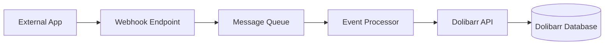
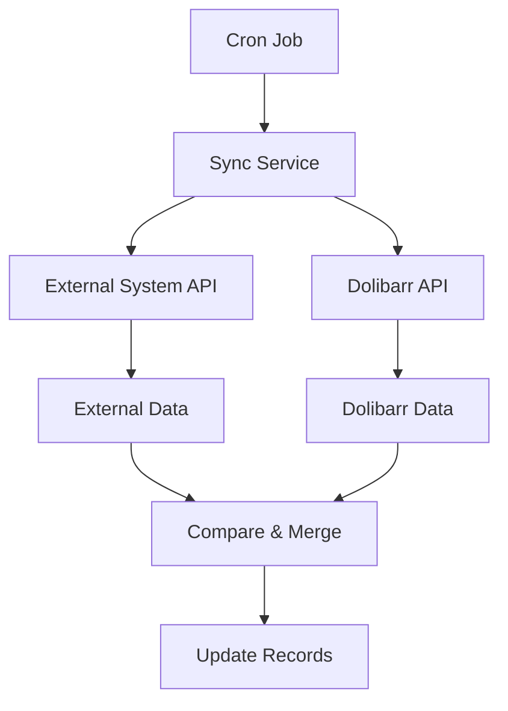
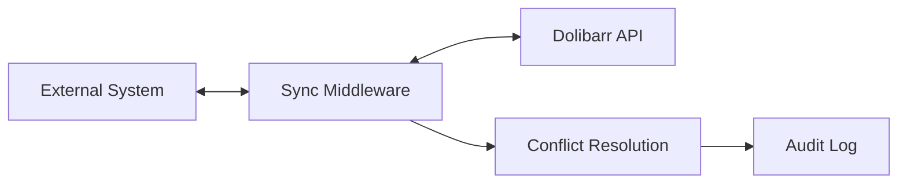

# Dolibarr API Integration Examples

This document provides practical examples of integrating with the Dolibarr REST API, including common patterns, code examples, and best practices.

## API Setup

### Enabling the API

```bash
# Enable API module
task config:enable-api

# Check API status
task config:show-config

# Access API documentation
# http://localhost:18080/api/index.php/explorer
```

### Authentication

The Dolibarr API uses API keys for authentication. Generate keys through:
1. Login to Dolibarr web interface
2. Navigate to Users & Groups → Users
3. Edit user → API Keys tab
4. Generate new API key

## Common Integration Patterns

### 1. Customer Management Integration

**Use Case**: Sync customer data between e-commerce platform and Dolibarr.

```javascript
class DolibarrCustomerSync {
  constructor(apiUrl, apiKey) {
    this.apiUrl = apiUrl;
    this.apiKey = apiKey;
  }

  async createCustomer(customerData) {
    const response = await fetch(`${this.apiUrl}/thirdparties`, {
      method: 'POST',
      headers: {
        'Content-Type': 'application/json',
        'DOLAPIKEY': this.apiKey
      },
      body: JSON.stringify({
        name: customerData.company || customerData.name,
        client: 1, // Mark as customer
        email: customerData.email,
        phone: customerData.phone,
        address: customerData.address,
        zip: customerData.zip,
        town: customerData.city,
        country_code: customerData.country
      })
    });

    return await response.json();
  }

  async updateCustomer(customerId, updates) {
    const response = await fetch(`${this.apiUrl}/thirdparties/${customerId}`, {
      method: 'PUT',
      headers: {
        'Content-Type': 'application/json',
        'DOLAPIKEY': this.apiKey
      },
      body: JSON.stringify(updates)
    });

    return await response.json();
  }

  async getCustomer(customerId) {
    const response = await fetch(`${this.apiUrl}/thirdparties/${customerId}`, {
      headers: {
        'DOLAPIKEY': this.apiKey
      }
    });

    return await response.json();
  }
}

// Usage example
const dolibarr = new DolibarrCustomerSync('http://localhost:18080/api/index.php', 'your-api-key');

// Create new customer
const newCustomer = await dolibarr.createCustomer({
  name: 'John Doe',
  email: 'john@example.com',
  phone: '+1234567890',
  address: '123 Main St',
  city: 'Anytown',
  zip: '12345',
  country: 'US'
});
```

### 2. Order Processing Integration

**Use Case**: Automatically create orders in Dolibarr from external sales channels.

```python
import requests
import json
from datetime import datetime

class DolibarrOrderManager:
    def __init__(self, api_url, api_key):
        self.api_url = api_url
        self.headers = {
            'Content-Type': 'application/json',
            'DOLAPIKEY': api_key
        }
    
    def create_order(self, customer_id, order_items, order_data=None):
        """Create a new order with line items."""
        
        # Create the order
        order_payload = {
            'socid': customer_id,
            'date': datetime.now().strftime('%Y-%m-%d'),
            'note_public': order_data.get('notes', ''),
            'ref_client': order_data.get('external_ref', '')
        }
        
        response = requests.post(
            f"{self.api_url}/orders",
            headers=self.headers,
            data=json.dumps(order_payload)
        )
        
        if response.status_code == 200:
            order_id = response.json()
            
            # Add order lines
            for item in order_items:
                self.add_order_line(order_id, item)
            
            return order_id
        else:
            raise Exception(f"Failed to create order: {response.text}")
    
    def add_order_line(self, order_id, item):
        """Add a line item to an existing order."""
        line_payload = {
            'fk_product': item.get('product_id'),
            'qty': item['quantity'],
            'subprice': item['unit_price'],
            'desc': item.get('description', ''),
            'tva_tx': item.get('vat_rate', 20)  # Default 20% VAT
        }
        
        response = requests.post(
            f"{self.api_url}/orders/{order_id}/lines",
            headers=self.headers,
            data=json.dumps(line_payload)
        )
        
        return response.json()

# Usage example
order_manager = DolibarrOrderManager('http://localhost:18080/api/index.php', 'your-api-key')

# Create order with multiple items
order_items = [
    {
        'product_id': 1,
        'quantity': 2,
        'unit_price': 99.99,
        'description': 'Professional Laptop',
        'vat_rate': 20
    },
    {
        'product_id': 2,
        'quantity': 1,
        'unit_price': 29.99,
        'description': 'Wireless Mouse',
        'vat_rate': 20
    }
]

order_id = order_manager.create_order(
    customer_id=123,
    order_items=order_items,
    order_data={'notes': 'Rush order', 'external_ref': 'WEB-001234'}
)
```

### 3. Invoice Generation Automation

**Use Case**: Automatically generate invoices based on project milestones or recurring billing.

```php
<?php
class DolibarrInvoiceGenerator {
    private $apiUrl;
    private $apiKey;
    
    public function __construct($apiUrl, $apiKey) {
        $this->apiUrl = $apiUrl;
        $this->apiKey = $apiKey;
    }
    
    public function createInvoice($customerId, $lines, $options = []) {
        $invoiceData = [
            'socid' => $customerId,
            'type' => $options['type'] ?? 0, // 0 = standard invoice
            'date' => date('Y-m-d'),
            'note_public' => $options['notes'] ?? '',
            'cond_reglement_id' => $options['payment_term'] ?? 1
        ];
        
        // Create invoice
        $response = $this->makeApiCall('/invoices', 'POST', $invoiceData);
        
        if ($response && isset($response['id'])) {
            $invoiceId = $response['id'];
            
            // Add invoice lines
            foreach ($lines as $line) {
                $this->addInvoiceLine($invoiceId, $line);
            }
            
            // Validate invoice if requested
            if ($options['validate'] ?? false) {
                $this->validateInvoice($invoiceId);
            }
            
            return $invoiceId;
        }
        
        throw new Exception('Failed to create invoice');
    }
    
    public function addInvoiceLine($invoiceId, $line) {
        $lineData = [
            'fk_product' => $line['product_id'] ?? null,
            'qty' => $line['quantity'],
            'subprice' => $line['unit_price'],
            'desc' => $line['description'],
            'tva_tx' => $line['vat_rate'] ?? 20
        ];
        
        return $this->makeApiCall("/invoices/$invoiceId/lines", 'POST', $lineData);
    }
    
    public function validateInvoice($invoiceId) {
        return $this->makeApiCall("/invoices/$invoiceId/validate", 'POST');
    }
    
    private function makeApiCall($endpoint, $method, $data = null) {
        $ch = curl_init();
        
        curl_setopt_array($ch, [
            CURLOPT_URL => $this->apiUrl . $endpoint,
            CURLOPT_RETURNTRANSFER => true,
            CURLOPT_CUSTOMREQUEST => $method,
            CURLOPT_HTTPHEADER => [
                'Content-Type: application/json',
                'DOLAPIKEY: ' . $this->apiKey
            ]
        ]);
        
        if ($data) {
            curl_setopt($ch, CURLOPT_POSTFIELDS, json_encode($data));
        }
        
        $response = curl_exec($ch);
        $httpCode = curl_getinfo($ch, CURLINFO_HTTP_CODE);
        curl_close($ch);
        
        if ($httpCode >= 200 && $httpCode < 300) {
            return json_decode($response, true);
        }
        
        return false;
    }
}

// Usage example
$invoiceGenerator = new DolibarrInvoiceGenerator('http://localhost:18080/api/index.php', 'your-api-key');

$invoiceLines = [
    [
        'product_id' => 1,
        'quantity' => 1,
        'unit_price' => 150.00,
        'description' => 'Consulting Services - January 2024',
        'vat_rate' => 20
    ]
];

$invoiceId = $invoiceGenerator->createInvoice(
    customerId: 123,
    lines: $invoiceLines,
    options: [
        'notes' => 'Monthly consulting invoice',
        'validate' => true,
        'payment_term' => 2 // 30 days
    ]
);
?>
```

### 4. Stock Management Integration

**Use Case**: Real-time stock level synchronization between warehouse management system and Dolibarr.

```go
package main

import (
    "bytes"
    "encoding/json"
    "fmt"
    "net/http"
)

type DolibarrStockManager struct {
    apiURL string
    apiKey string
    client *http.Client
}

type StockMovement struct {
    ProductID   int     `json:"fk_product"`
    WarehouseID int     `json:"fk_entrepot"`
    Quantity    float64 `json:"qty"`
    Type        int     `json:"type"` // 0=input, 1=output
    Label       string  `json:"label"`
    Price       float64 `json:"price,omitempty"`
}

func NewDolibarrStockManager(apiURL, apiKey string) *DolibarrStockManager {
    return &DolibarrStockManager{
        apiURL: apiURL,
        apiKey: apiKey,
        client: &http.Client{},
    }
}

func (dsm *DolibarrStockManager) UpdateStock(movement StockMovement) error {
    payload, _ := json.Marshal(movement)
    
    req, err := http.NewRequest("POST", dsm.apiURL+"/stockmovements", bytes.NewBuffer(payload))
    if err != nil {
        return err
    }
    
    req.Header.Set("Content-Type", "application/json")
    req.Header.Set("DOLAPIKEY", dsm.apiKey)
    
    resp, err := dsm.client.Do(req)
    if err != nil {
        return err
    }
    defer resp.Body.Close()
    
    if resp.StatusCode >= 200 && resp.StatusCode < 300 {
        return nil
    }
    
    return fmt.Errorf("API request failed with status: %d", resp.StatusCode)
}

func (dsm *DolibarrStockManager) GetProductStock(productID, warehouseID int) (float64, error) {
    url := fmt.Sprintf("%s/products/%d/stock?warehouse_id=%d", dsm.apiURL, productID, warehouseID)
    
    req, err := http.NewRequest("GET", url, nil)
    if err != nil {
        return 0, err
    }
    
    req.Header.Set("DOLAPIKEY", dsm.apiKey)
    
    resp, err := dsm.client.Do(req)
    if err != nil {
        return 0, err
    }
    defer resp.Body.Close()
    
    var stockData map[string]interface{}
    json.NewDecoder(resp.Body).Decode(&stockData)
    
    if qty, ok := stockData["stock_reel"].(float64); ok {
        return qty, nil
    }
    
    return 0, fmt.Errorf("unable to parse stock quantity")
}

// Usage example
func main() {
    stockManager := NewDolibarrStockManager("http://localhost:18080/api/index.php", "your-api-key")
    
    // Record stock input
    movement := StockMovement{
        ProductID:   1,
        WarehouseID: 1,
        Quantity:    100,
        Type:        0, // Input
        Label:       "Received from supplier",
        Price:       50.00,
    }
    
    err := stockManager.UpdateStock(movement)
    if err != nil {
        fmt.Printf("Error updating stock: %v\n", err)
    } else {
        fmt.Println("Stock updated successfully")
    }
    
    // Check current stock level
    currentStock, err := stockManager.GetProductStock(1, 1)
    if err != nil {
        fmt.Printf("Error getting stock: %v\n", err)
    } else {
        fmt.Printf("Current stock: %.2f\n", currentStock)
    }
}
```

## Integration Architectures

### 1. Event-Driven Integration



### 2. Scheduled Synchronization



### 3. Real-time Bidirectional Sync



## Error Handling & Best Practices

### Rate Limiting

```python
import time
from functools import wraps

def rate_limit(max_calls=60, period=60):
    """Decorator to limit API calls per period."""
    calls = []
    
    def decorator(func):
        @wraps(func)
        def wrapper(*args, **kwargs):
            now = time.time()
            # Remove calls older than the period
            calls[:] = [call for call in calls if call > now - period]
            
            if len(calls) >= max_calls:
                sleep_time = period - (now - calls[0])
                time.sleep(sleep_time)
            
            calls.append(now)
            return func(*args, **kwargs)
        return wrapper
    return decorator

class DolibarrAPIClient:
    def __init__(self, api_url, api_key):
        self.api_url = api_url
        self.api_key = api_key
    
    @rate_limit(max_calls=50, period=60)  # 50 calls per minute
    def make_api_call(self, endpoint, method='GET', data=None):
        # API call implementation
        pass
```

### Error Handling

```javascript
class DolibarrAPIError extends Error {
  constructor(message, statusCode, response) {
    super(message);
    this.statusCode = statusCode;
    this.response = response;
  }
}

class DolibarrAPI {
  async makeRequest(endpoint, options = {}) {
    const maxRetries = 3;
    let retries = 0;
    
    while (retries < maxRetries) {
      try {
        const response = await fetch(`${this.apiUrl}${endpoint}`, {
          ...options,
          headers: {
            'DOLAPIKEY': this.apiKey,
            'Content-Type': 'application/json',
            ...options.headers
          }
        });
        
        if (response.ok) {
          return await response.json();
        }
        
        // Handle specific error cases
        if (response.status === 429) {
          // Rate limited - wait and retry
          await this.wait(Math.pow(2, retries) * 1000);
          retries++;
          continue;
        }
        
        if (response.status >= 500) {
          // Server error - retry
          retries++;
          await this.wait(1000);
          continue;
        }
        
        // Client error - don't retry
        throw new DolibarrAPIError(
          `API error: ${response.statusText}`,
          response.status,
          await response.text()
        );
        
      } catch (error) {
        if (retries === maxRetries - 1) {
          throw error;
        }
        retries++;
        await this.wait(1000);
      }
    }
  }
  
  wait(ms) {
    return new Promise(resolve => setTimeout(resolve, ms));
  }
}
```

## Testing Integration

### Unit Testing

```python
import unittest
from unittest.mock import patch, Mock
import json

class TestDolibarrIntegration(unittest.TestCase):
    def setUp(self):
        self.api_client = DolibarrAPIClient('http://localhost:18080/api/index.php', 'test-key')
    
    @patch('requests.post')
    def test_create_customer_success(self, mock_post):
        # Mock successful API response
        mock_response = Mock()
        mock_response.status_code = 200
        mock_response.json.return_value = {'id': 123}
        mock_post.return_value = mock_response
        
        # Test customer creation
        customer_data = {
            'name': 'Test Customer',
            'email': 'test@example.com'
        }
        
        result = self.api_client.create_customer(customer_data)
        
        self.assertEqual(result['id'], 123)
        mock_post.assert_called_once()
    
    @patch('requests.post')
    def test_create_customer_failure(self, mock_post):
        # Mock API error response
        mock_response = Mock()
        mock_response.status_code = 400
        mock_response.text = 'Bad Request'
        mock_post.return_value = mock_response
        
        customer_data = {
            'name': 'Test Customer'
        }
        
        with self.assertRaises(DolibarrAPIError):
            self.api_client.create_customer(customer_data)

if __name__ == '__main__':
    unittest.main()
```

### Integration Testing

```bash
#!/bin/bash
# integration_test.sh

# Start test environment
task services:start-with-tools
task config:enable-api

# Wait for services to be ready
sleep 30

# Run integration tests
python -m pytest tests/integration/ -v

# Cleanup
task services:stop
```

## Monitoring & Logging

### API Usage Monitoring

```python
import logging
import time
from functools import wraps

# Configure logging
logging.basicConfig(
    level=logging.INFO,
    format='%(asctime)s - %(name)s - %(levelname)s - %(message)s',
    handlers=[
        logging.FileHandler('dolibarr_api.log'),
        logging.StreamHandler()
    ]
)

logger = logging.getLogger('dolibarr_integration')

def log_api_call(func):
    @wraps(func)
    def wrapper(*args, **kwargs):
        start_time = time.time()
        
        try:
            result = func(*args, **kwargs)
            duration = time.time() - start_time
            
            logger.info(f"API call successful: {func.__name__}, duration: {duration:.2f}s")
            return result
            
        except Exception as e:
            duration = time.time() - start_time
            logger.error(f"API call failed: {func.__name__}, duration: {duration:.2f}s, error: {str(e)}")
            raise
    
    return wrapper
```

## Conclusion

The Dolibarr API provides comprehensive access to business data and operations. When integrating:

1. **Plan your architecture** based on your specific needs
2. **Implement proper error handling** and retry logic
3. **Use rate limiting** to avoid overwhelming the API
4. **Monitor and log** API usage for debugging and optimization
5. **Test thoroughly** with both unit and integration tests
6. **Follow security best practices** for API key management

The examples provided should give you a solid foundation for building robust integrations with the Dolibarr Docker setup.
