# API and Service Reference

This document provides comprehensive information about accessing Dolibarr services, APIs, and endpoints in the Docker deployment environment.

## Service Endpoints

### Web Services Overview

```mermaid
graph LR
    subgraph "External Access"
        BROWSER[Web Browser]
        API_CLIENT[API Clients]
        DB_CLIENT[Database Tools]
        ADMIN[Administrators]
    end
    
    subgraph "Docker Services"
        DOLIBARR[🏢 Dolibarr<br/>:8080]
        API[📡 REST API<br/>:8080/api]
        PMA[🔧 phpMyAdmin<br/>:8081]
        DB[🗄️ MariaDB<br/>:3306]
    end
    
    BROWSER --> DOLIBARR
    API_CLIENT --> API
    ADMIN --> PMA
    DB_CLIENT --> DB
    
    API -.-> DOLIBARR
    PMA -.-> DB
    DOLIBARR -.-> DB
    
    style DOLIBARR fill:#e1f5fe
    style API fill:#e8f5e8
    style PMA fill:#fff3e0
    style DB fill:#f3e5f5
```



## Web Interface Access

### Primary Application

**Endpoint**: `http://localhost:8080`

**Purpose**: Main Dolibarr ERP/CRM web interface

**Authentication**: Session-based with login form

**Default Credentials** (Change immediately!):
- Username: `admin`
- Password: Set via `DOLIBARR_ADMIN_PASSWORD` in `.env`

**Health Check**:
```bash
curl -I http://localhost:8080
# Expected: HTTP/1.1 200 OK
```

### Access Examples

```bash
# Basic connectivity test
curl -f http://localhost:8080 > /dev/null && echo "✅ Web interface accessible"

# Check response time
curl -w "@curl-format.txt" -o /dev/null -s http://localhost:8080

# Check with authentication (if required)
curl -c cookies.txt -b cookies.txt \
  -d "username=admin&password=$ADMIN_PASSWORD" \
  -X POST http://localhost:8080/index.php
```

## Dolibarr REST API

### API Base URL

**Endpoint**: `http://localhost:8080/api/index.php`

**Documentation**: Available at `http://localhost:8080/api/index.php/explorer`

**Authentication**: API Key or Session-based

### API Authentication

#### Method 1: API Key Authentication

1. **Generate API Key**:
   - Login to Dolibarr web interface
   - Go to: Home → Setup → Modules/Applications
   - Enable "REST API" module
   - Go to: Users & Groups → Users
   - Edit your user → Generate API key

2. **Use API Key**:
   ```bash
   # Set API key
   export DOLIBARR_API_KEY="your-api-key-here"
   
   # Make API request
   curl -H "DOLAPIKEY: $DOLIBARR_API_KEY" \
     http://localhost:8080/api/index.php/users
   ```

#### Method 2: Session Authentication

```bash
# Login and get session
curl -c cookies.txt \
  -d "username=admin&password=$ADMIN_PASSWORD" \
  -X POST http://localhost:8080/index.php

# Use session for API calls
curl -b cookies.txt \
  http://localhost:8080/api/index.php/users
```

### Core API Endpoints

#### Users Management

```bash
# List users
GET /api/index.php/users

# Get specific user
GET /api/index.php/users/{id}

# Create user
POST /api/index.php/users

# Update user
PUT /api/index.php/users/{id}

# Delete user
DELETE /api/index.php/users/{id}
```

**Example**:
```bash
# List all users
curl -H "DOLAPIKEY: $DOLIBARR_API_KEY" \
  http://localhost:8080/api/index.php/users

# Get user by ID
curl -H "DOLAPIKEY: $DOLIBARR_API_KEY" \
  http://localhost:8080/api/index.php/users/1
```

#### Companies (Third Parties)

```bash
# List companies
GET /api/index.php/thirdparties

# Get specific company
GET /api/index.php/thirdparties/{id}

# Create company
POST /api/index.php/thirdparties

# Update company
PUT /api/index.php/thirdparties/{id}
```

**Example**:
```bash
# Create new company
curl -H "DOLAPIKEY: $DOLIBARR_API_KEY" \
  -H "Content-Type: application/json" \
  -X POST \
  -d '{"name": "Acme Corp", "client": 1}' \
  http://localhost:8080/api/index.php/thirdparties
```

#### Products

```bash
# List products
GET /api/index.php/products

# Get specific product
GET /api/index.php/products/{id}

# Create product
POST /api/index.php/products

# Update product
PUT /api/index.php/products/{id}
```

#### Invoices

```bash
# List invoices
GET /api/index.php/invoices

# Get specific invoice
GET /api/index.php/invoices/{id}

# Create invoice
POST /api/index.php/invoices

# Validate invoice
POST /api/index.php/invoices/{id}/validate
```

#### Orders

```bash
# List orders
GET /api/index.php/orders

# Get specific order
GET /api/index.php/orders/{id}

# Create order
POST /api/index.php/orders

# Close order
POST /api/index.php/orders/{id}/close
```

### API Response Format

All API responses follow this structure:

```json
{
  "success": {
    "code": 200,
    "message": "Success message"
  },
  "data": {
    // Response data here
  }
}
```

**Error Response**:
```json
{
  "error": {
    "code": 400,
    "message": "Error description"
  }
}
```

### API Usage Examples

#### Complete Workflow Example

```bash
#!/bin/bash
# API workflow example

API_KEY="your-api-key"
BASE_URL="http://localhost:8080/api/index.php"
HEADERS="DOLAPIKEY: $API_KEY"

# 1. Create a company
echo "Creating company..."
COMPANY_ID=$(curl -s -H "$HEADERS" -H "Content-Type: application/json" \
  -X POST -d '{"name": "Test Company", "client": 1}' \
  "$BASE_URL/thirdparties" | jq -r '.id')

echo "Company created with ID: $COMPANY_ID"

# 2. Create a product
echo "Creating product..."
PRODUCT_ID=$(curl -s -H "$HEADERS" -H "Content-Type: application/json" \
  -X POST -d '{"ref": "PROD001", "label": "Test Product", "price": 100}' \
  "$BASE_URL/products" | jq -r '.id')

echo "Product created with ID: $PRODUCT_ID"

# 3. Create an invoice
echo "Creating invoice..."
INVOICE_DATA='{
  "socid": '$COMPANY_ID',
  "type": 0,
  "lines": [
    {
      "fk_product": '$PRODUCT_ID',
      "qty": 2,
      "subprice": 100
    }
  ]
}'

INVOICE_ID=$(curl -s -H "$HEADERS" -H "Content-Type: application/json" \
  -X POST -d "$INVOICE_DATA" \
  "$BASE_URL/invoices" | jq -r '.id')

echo "Invoice created with ID: $INVOICE_ID"
```

## Database Direct Access

### Connection Parameters

**Host**: `localhost` (from Docker host)
**Port**: `3306`
**Database**: `dolibarr`
**Username**: `dolibarr` (or `root` for full access)
**Password**: Set via `DB_PASSWORD` or `DB_ROOT_PASSWORD`

### Connection Methods

#### MySQL Command Line

```bash
# Connect as dolibarr user
mysql -h localhost -P 3306 -u dolibarr -p dolibarr

# Connect as root user
mysql -h localhost -P 3306 -u root -p dolibarr
```

#### Via Docker Container

```bash
# Connect to database from within Docker network
docker-compose exec dolibarr-db mysql -u root -p dolibarr

# Execute single command
docker-compose exec dolibarr-db mysql -u root -p$DB_ROOT_PASSWORD -e "SHOW TABLES;" dolibarr
```

#### Using Database Clients

**Connection String Examples**:

- **DBeaver/DataGrip**: `jdbc:mysql://localhost:3306/dolibarr`
- **Sequel Pro**: Host: `localhost`, Port: `3306`, Database: `dolibarr`
- **phpMyAdmin**: Available at `http://localhost:8081` (if enabled)

### Database Schema Access

```sql
-- Show all tables
SHOW TABLES;

-- Show table structure
DESCRIBE llx_user;

-- Show table relationships
SELECT 
  TABLE_NAME,
  COLUMN_NAME,
  CONSTRAINT_NAME,
  REFERENCED_TABLE_NAME,
  REFERENCED_COLUMN_NAME 
FROM INFORMATION_SCHEMA.KEY_COLUMN_USAGE 
WHERE REFERENCED_TABLE_SCHEMA = 'dolibarr';
```

## phpMyAdmin Interface

### Access Information

**URL**: `http://localhost:8081`
**Availability**: Only when using `internal-db-tools` profile
**Authentication**: Database credentials

### Login Credentials

- **Username**: `dolibarr` or `root`
- **Password**: `DB_PASSWORD` or `DB_ROOT_PASSWORD`
- **Server**: `dolibarr-db` (automatically configured)

### Features Available

- Database schema browsing
- SQL query execution
- Data import/export
- User management
- Performance monitoring
- Database maintenance

### Security Note

⚠️ **Production Warning**: Disable phpMyAdmin in production environments by not using the `internal-db-tools` profile.

## Service Health Monitoring

### Health Check Endpoints

#### Application Health

```bash
# Basic health check
curl -f http://localhost:8080 > /dev/null && echo "✅ Application healthy"

# Detailed status check
curl -s -w "%{http_code}" http://localhost:8080 | grep -q "200" && echo "✅ OK" || echo "❌ Error"
```

#### Database Health

```bash
# Database connectivity test
docker-compose exec dolibarr-db mysql -u root -p$DB_ROOT_PASSWORD -e "SELECT 1" > /dev/null && echo "✅ Database healthy"

# Performance check
docker-compose exec dolibarr-db mysql -u root -p$DB_ROOT_PASSWORD -e "SHOW STATUS LIKE 'Threads_connected'"
```

### Automated Health Monitoring

```bash
#!/bin/bash
# health-monitor.sh

check_service() {
    local service=$1
    local url=$2
    
    if curl -f "$url" > /dev/null 2>&1; then
        echo "✅ $service: OK"
        return 0
    else
        echo "❌ $service: FAILED"
        return 1
    fi
}

# Check all services
check_service "Dolibarr" "http://localhost:8080"
check_service "phpMyAdmin" "http://localhost:8081" || echo "ℹ️ phpMyAdmin may not be enabled"

# Check database
if docker-compose exec dolibarr-db mysql -u root -p$DB_ROOT_PASSWORD -e "SELECT 1" > /dev/null 2>&1; then
    echo "✅ Database: OK"
else
    echo "❌ Database: FAILED"
fi
```

## API Security Best Practices

### Authentication Security

1. **Use API Keys Instead of Passwords**:
   ```bash
   # Good: API key authentication
   curl -H "DOLAPIKEY: $API_KEY" http://localhost:8080/api/index.php/users
   
   # Avoid: Password in URL or headers
   ```

2. **Rotate API Keys Regularly**:
   ```bash
   # Generate new API key periodically
   # Update all applications using the old key
   ```

3. **Limit API Key Permissions**:
   - Create dedicated API users
   - Grant minimum required permissions
   - Use different keys for different applications

### Network Security

1. **Use HTTPS in Production**:
   ```bash
   # Production API access
   curl -H "DOLAPIKEY: $API_KEY" https://your-domain.com/api/index.php/users
   ```

2. **Restrict API Access**:
   ```bash
   # Firewall rules to limit API access
   ufw allow from 192.168.1.0/24 to any port 8080
   ```

3. **Use Reverse Proxy**:
   ```nginx
   # nginx configuration for API proxy
   location /api/ {
       proxy_pass http://localhost:8080/api/;
       proxy_set_header X-API-Key $http_dolapikey;
   }
   ```

### Rate Limiting

```bash
#!/bin/bash
# Simple rate limiting example
API_LOG="/tmp/api_calls.log"
MAX_CALLS=100
WINDOW=3600  # 1 hour

# Log API call
echo "$(date +%s) $REMOTE_ADDR" >> $API_LOG

# Check rate limit
RECENT_CALLS=$(awk -v now=$(date +%s) -v window=$WINDOW \
  '$1 > (now - window)' $API_LOG | wc -l)

if [ $RECENT_CALLS -gt $MAX_CALLS ]; then
    echo "Rate limit exceeded"
    exit 1
fi
```

## Integration Examples

### Python Integration

```python
import requests
import json

class DolibarrAPI:
    def __init__(self, base_url, api_key):
        self.base_url = base_url
        self.headers = {
            'DOLAPIKEY': api_key,
            'Content-Type': 'application/json'
        }
    
    def get_users(self):
        response = requests.get(f"{self.base_url}/users", headers=self.headers)
        return response.json()
    
    def create_company(self, name, is_client=True):
        data = {
            'name': name,
            'client': 1 if is_client else 0
        }
        response = requests.post(f"{self.base_url}/thirdparties", 
                               headers=self.headers, 
                               data=json.dumps(data))
        return response.json()

# Usage
api = DolibarrAPI('http://localhost:8080/api/index.php', 'your-api-key')
users = api.get_users()
```

### JavaScript Integration

```javascript
class DolibarrAPI {
    constructor(baseUrl, apiKey) {
        this.baseUrl = baseUrl;
        this.headers = {
            'DOLAPIKEY': apiKey,
            'Content-Type': 'application/json'
        };
    }
    
    async getUsers() {
        const response = await fetch(`${this.baseUrl}/users`, {
            headers: this.headers
        });
        return await response.json();
    }
    
    async createInvoice(invoiceData) {
        const response = await fetch(`${this.baseUrl}/invoices`, {
            method: 'POST',
            headers: this.headers,
            body: JSON.stringify(invoiceData)
        });
        return await response.json();
    }
}

// Usage
const api = new DolibarrAPI('http://localhost:8080/api/index.php', 'your-api-key');
api.getUsers().then(users => console.log(users));
```

### cURL Scripts for Common Operations

```bash
#!/bin/bash
# dolibarr-api-tools.sh

API_KEY="your-api-key"
BASE_URL="http://localhost:8080/api/index.php"

# Function to make API calls
api_call() {
    local method=$1
    local endpoint=$2
    local data=$3
    
    if [ -n "$data" ]; then
        curl -s -H "DOLAPIKEY: $API_KEY" -H "Content-Type: application/json" \
             -X "$method" -d "$data" "$BASE_URL/$endpoint"
    else
        curl -s -H "DOLAPIKEY: $API_KEY" -X "$method" "$BASE_URL/$endpoint"
    fi
}

# Export functions
export -f api_call
export API_KEY BASE_URL

# Usage examples
echo "Users:"
api_call GET "users" | jq '.[].login'

echo "Companies:"
api_call GET "thirdparties" | jq '.[].name'
```

This API reference provides comprehensive access information for all Dolibarr Docker services and endpoints.
