# System Architecture

This document provides a comprehensive overview of the Dolibarr Docker deployment architecture, covering container orchestration, service relationships, data flow, and system design principles.

## High-Level Architecture

### System Overview

```mermaid
graph TB
    subgraph "External Network"
        USER[👤 End Users]
        ADMIN[👨‍💼 Administrators]
        API_CLIENT[🔗 API Clients]
    end
    
    subgraph "Docker Host Environment"
        subgraph "Reverse Proxy Layer (Optional)"
            NGINX[🌐 Nginx/Traefik<br/>SSL Termination]
        end
        
        subgraph "Application Layer"
            DOLIBARR[🏢 Dolibarr ERP/CRM<br/>Port: 8080]
        end
        
        subgraph "Database Layer"
            INTERNAL_DB[🗄️ MariaDB Internal<br/>Port: 3306]
            EXTERNAL_DB[🌍 External Database<br/>MySQL/MariaDB]
        end
        
        subgraph "Management Layer"
            PHPMYADMIN[🔧 phpMyAdmin<br/>Port: 8081]
        end
        
        subgraph "Storage Layer"
            HTML_VOL[(📁 HTML Volume<br/>Application Files)]
            DOC_VOL[(📄 Documents Volume<br/>User Data)]
            DB_VOL[(💾 Database Volume<br/>MariaDB Data)]
            CUSTOM_DIR[📦 Custom Modules<br/>Host Mount]
            LOGS_DIR[📋 Logs Directory<br/>Host Mount]
            BACKUP_DIR[💾 Backup Storage<br/>Host Mount]
        end
        
        subgraph "Automation Layer"
            TASKFILE[⚙️ Task Automation<br/>Management Scripts]
        end
    end
    
    USER -->|HTTPS/HTTP| NGINX
    ADMIN -->|HTTPS/HTTP| NGINX
    API_CLIENT -->|REST API| NGINX
    NGINX -->|HTTP| DOLIBARR
    ADMIN -->|Direct Access| PHPMYADMIN
    
    DOLIBARR -.->|Profile: internal-db| INTERNAL_DB
    DOLIBARR -.->|Profile: external-db| EXTERNAL_DB
    PHPMYADMIN --> INTERNAL_DB
    
    DOLIBARR --> HTML_VOL
    DOLIBARR --> DOC_VOL
    DOLIBARR --> CUSTOM_DIR
    DOLIBARR --> LOGS_DIR
    INTERNAL_DB --> DB_VOL
    
    TASKFILE -.-> DOLIBARR
    TASKFILE -.-> INTERNAL_DB
    TASKFILE -.-> PHPMYADMIN
    TASKFILE -.-> BACKUP_DIR
    
    style DOLIBARR fill:#e1f5fe
    style INTERNAL_DB fill:#f3e5f5
    style EXTERNAL_DB fill:#ffebee
    style PHPMYADMIN fill:#fff3e0
    style TASKFILE fill:#e8f5e8
```



## Container Architecture

### Service Composition

| Service | Container | Image | Purpose | Profile |
|---------|-----------|-------|---------|---------|
| **dolibarr** | Application Server | `dolibarr/dolibarr:latest` | Main ERP/CRM application | All profiles |
| **dolibarr-db** | Database Server | `mariadb:10.11` | Internal database | `internal-db` |
| **phpmyadmin** | Database Admin | `phpmyadmin/phpmyadmin:latest` | Database management UI | `internal-db-tools` |

### Container Relationships


## Deployment Profiles

The system supports three distinct deployment profiles, each optimized for different use cases:

### Profile: internal-db

**Architecture**: Standalone deployment with containerized database

```mermaid
graph TB
    subgraph "Docker Compose Profile: internal-db"
        APP[🏢 Dolibarr Application]
        DB[🗄️ MariaDB Database]
        
        APP -->|MySQL Connection| DB
        
        subgraph "Volumes"
            V1[(HTML Volume)]
            V2[(Documents Volume)]
            V3[(Database Volume)]
        end
        
        APP --> V1
        APP --> V2
        DB --> V3
    end
    
    USER[👤 User] -->|HTTP :8080| APP
    
    style APP fill:#e1f5fe
    style DB fill:#f3e5f5
```



**Use Cases**:
- Development environments
- Testing deployments
- Small-scale production (single server)
- Proof of concept installations

**Resource Requirements**:
- **CPU**: 1-2 cores
- **Memory**: 2-4 GB RAM
- **Storage**: 10-20 GB

### Profile: internal-db-tools

**Architecture**: Development environment with administration tools

```mermaid
graph TB
    subgraph "Docker Compose Profile: internal-db-tools"
        APP[🏢 Dolibarr Application]
        DB[🗄️ MariaDB Database]
        PMA[🔧 phpMyAdmin]
        
        APP -->|MySQL Connection| DB
        PMA -->|MySQL Connection| DB
        
        subgraph "Volumes"
            V1[(HTML Volume)]
            V2[(Documents Volume)]
            V3[(Database Volume)]
        end
        
        APP --> V1
        APP --> V2
        DB --> V3
    end
    
    USER[👤 User] -->|HTTP :8080| APP
    ADMIN[👨‍💼 Admin] -->|HTTP :8081| PMA
    
    style APP fill:#e1f5fe
    style DB fill:#f3e5f5
    style PMA fill:#fff3e0
```



**Use Cases**:
- Development with database administration
- Training environments
- Database troubleshooting
- Development team collaboration

**Additional Features**:
- Web-based database management
- SQL query execution
- Database schema visualization
- Import/export functionality

### Profile: external-db

**Architecture**: Production deployment with external database

```mermaid
graph TB
    subgraph "Docker Compose Profile: external-db"
        APP[🏢 Dolibarr Application]
        
        subgraph "Volumes"
            V1[(HTML Volume)]
            V2[(Documents Volume)]
        end
        
        APP --> V1
        APP --> V2
    end
    
    subgraph "External Infrastructure"
        EXT_DB[(🌍 External Database<br/>MySQL/MariaDB)]
    end
    
    APP -->|Network Connection| EXT_DB
    USER[👤 User] -->|HTTP :8080| APP
    
    style APP fill:#e1f5fe
    style EXT_DB fill:#ffebee
```



**Use Cases**:
- Production environments
- High-availability deployments
- Multi-instance scaling
- Existing database infrastructure integration

**Requirements**:
- External MySQL 5.7+ or MariaDB 10.3+
- Network connectivity from Docker host
- Proper database user privileges
- Backup/replication handled externally

## Data Flow Architecture

### Application Data Flow


### Database Schema Architecture

```mermaid
erDiagram
    CORE_BUSINESS {
        societe "Companies"
        user "Users"
        product "Products"
        facture "Invoices"
        commande "Orders"
        propal "Proposals"
    }
    
    CONFIGURATION {
        const "System Configuration"
        menu "Menu Structure"
        dictionaries "Reference Data"
    }
    
    MODULES {
        adherent "Members"
        projet "Projects"
        actioncomm "Activities"
        stock "Inventory"
    }
    
    SYSTEM {
        extrafields "Custom Fields"
        categories "Classifications"
        element_categorie "Category Links"
    }
    
    CORE_BUSINESS ||--o{ MODULES : "extends"
    CONFIGURATION ||--o{ CORE_BUSINESS : "configures"
    SYSTEM ||--o{ CORE_BUSINESS : "enhances"
    SYSTEM ||--o{ MODULES : "enhances"
```

## Network Architecture

### Internal Networking


### Port Configuration

| Service | Internal Port | External Port | Protocol | Purpose |
|---------|---------------|---------------|----------|---------|
| Dolibarr | 80 | 8080 | HTTP | Web interface |
| MariaDB | 3306 | 3306 | MySQL | Database access |
| phpMyAdmin | 80 | 8081 | HTTP | Database admin |

### Security Boundaries

```mermaid
graph TB
    subgraph "Security Zones"
        subgraph "Public Zone"
            INTERNET[🌍 Internet]
            USERS[👥 Users]
        end
        
        subgraph "DMZ (Optional)"
            PROXY[🛡️ Reverse Proxy<br/>SSL Termination]
            FIREWALL[🔥 Firewall Rules]
        end
        
        subgraph "Application Zone"
            APP[🏢 Dolibarr<br/>Application]
        end
        
        subgraph "Data Zone"
            DB[🗄️ Database<br/>Storage]
            FILES[(📁 File Storage)]
        end
    end
    
    INTERNET --> PROXY
    USERS --> PROXY
    PROXY --> FIREWALL
    FIREWALL --> APP
    APP --> DB
    APP --> FILES
    
    style PROXY fill:#fff3e0
    style FIREWALL fill:#ffebee
    style APP fill:#e1f5fe
    style DB fill:#f3e5f5
```



## Storage Architecture

### Volume Management


### Data Persistence Strategy

| Storage Type | Purpose | Backup Priority | Persistence Method |
|--------------|---------|-----------------|-------------------|
| **Database** | Core business data | **Critical** | Docker volume + automated backups |
| **Documents** | User uploads, files | **High** | Docker volume + file-level backups |
| **Application** | Dolibarr installation | Medium | Docker volume (recoverable from image) |
| **Custom Modules** | Custom code | **High** | Host mount + version control |
| **Logs** | Application logs | Low | Host mount (rotated/cleaned) |
| **Backups** | Data backups | **Critical** | Host mount + external storage |

## Scalability Architecture

### Horizontal Scaling Options

```mermaid
graph TB
    subgraph "Load Balancer"
        LB[🔄 Load Balancer<br/>Nginx/HAProxy]
    end
    
    subgraph "Application Tier"
        APP1[Dolibarr Instance 1]
        APP2[Dolibarr Instance 2]
        APP3[Dolibarr Instance 3]
    end
    
    subgraph "Database Tier"
        subgraph "Master-Slave Configuration"
            MASTER[(🗄️ Master Database<br/>Read/Write)]
            SLAVE1[(🗄️ Slave Database 1<br/>Read Only)]
            SLAVE2[(🗄️ Slave Database 2<br/>Read Only)]
        end
    end
    
    subgraph "Shared Storage"
        NFS[📁 NFS/GFS<br/>Shared Documents]
    end
    
    LB --> APP1
    LB --> APP2
    LB --> APP3
    
    APP1 --> MASTER
    APP2 --> MASTER
    APP3 --> MASTER
    
    APP1 -.->|Read Operations| SLAVE1
    APP2 -.->|Read Operations| SLAVE2
    APP3 -.->|Read Operations| SLAVE1
    
    MASTER -.->|Replication| SLAVE1
    MASTER -.->|Replication| SLAVE2
    
    APP1 --> NFS
    APP2 --> NFS
    APP3 --> NFS
    
    style LB fill:#fff3e0
    style MASTER fill:#f3e5f5
    style SLAVE1 fill:#e8f5e8
    style SLAVE2 fill:#e8f5e8
```



### Performance Considerations

#### Database Performance

```sql
-- Recommended MySQL/MariaDB configuration
[mysqld]
# Performance tuning
innodb_buffer_pool_size = 1G          # 70-80% of available RAM
innodb_log_file_size = 256M
innodb_flush_log_at_trx_commit = 2
innodb_flush_method = O_DIRECT

# Connection handling
max_connections = 200
thread_cache_size = 50
query_cache_size = 64M
query_cache_type = 1

# Replication (if using)
server-id = 1
log-bin = mysql-bin
binlog_format = mixed
```

#### Application Performance

- **PHP Configuration**:
  ```ini
  memory_limit = 512M
  max_execution_time = 300
  upload_max_filesize = 100M
  post_max_size = 100M
  ```

- **Caching Strategy**:
  - Redis/Memcached for session storage
  - File-based caching for static content
  - Database query caching

#### Container Resources

```yaml
# Resource limits in docker-compose.yml
services:
  dolibarr:
    deploy:
      resources:
        limits:
          memory: 1G
          cpus: '1.0'
        reservations:
          memory: 512M
          cpus: '0.5'
  
  dolibarr-db:
    deploy:
      resources:
        limits:
          memory: 2G
          cpus: '2.0'
        reservations:
          memory: 1G
          cpus: '1.0'
```

## Security Architecture

### Security Layers

```mermaid
graph TB
    subgraph "Security Implementation"
        subgraph "Network Security"
            FW[🔥 Firewall Rules]
            VPN[🔒 VPN Access]
            SSL[🛡️ SSL/TLS Encryption]
        end
        
        subgraph "Application Security"
            AUTH[👤 Authentication]
            AUTHZ[🔑 Authorization]
            CSRF[🛡️ CSRF Protection]
        end
        
        subgraph "Data Security"
            ENCRYPT[🔐 Data Encryption]
            BACKUP[💾 Encrypted Backups]
            AUDIT[📋 Audit Logging]
        end
        
        subgraph "Container Security"
            SECRETS[🔑 Docker Secrets]
            SCAN[🔍 Image Scanning]
            RUNTIME[🛡️ Runtime Security]
        end
    end
    
    FW --> AUTH
    SSL --> AUTH
    AUTH --> AUTHZ
    AUTHZ --> ENCRYPT
    ENCRYPT --> BACKUP
    SECRETS --> RUNTIME
    SCAN --> RUNTIME
```



### Security Best Practices

1. **Network Security**:
   - Use reverse proxy with SSL termination
   - Restrict database port access
   - Implement firewall rules
   - Consider VPN for administrative access

2. **Application Security**:
   - Change default passwords
   - Implement strong password policies
   - Enable two-factor authentication
   - Regular security updates

3. **Container Security**:
   - Use Docker secrets for sensitive data
   - Regular image updates
   - Non-root container execution
   - Resource limits and constraints

4. **Data Security**:
   - Encrypted backups
   - Secure backup storage
   - Audit trail logging
   - Data retention policies

## Monitoring Architecture

### System Monitoring

```mermaid
graph TB
    subgraph "Monitoring Stack"
        subgraph "Metrics Collection"
            CADVISOR[📊 cAdvisor<br/>Container Metrics]
            NODEEXP[📊 Node Exporter<br/>System Metrics]
        end
        
        subgraph "Metrics Storage"
            PROMETHEUS[🗄️ Prometheus<br/>Time Series DB]
        end
        
        subgraph "Visualization"
            GRAFANA[📈 Grafana<br/>Dashboards]
        end
        
        subgraph "Alerting"
            ALERTMANAGER[🚨 Alert Manager<br/>Notifications]
        end
        
        subgraph "Log Management"
            LOGS[📋 Container Logs]
            LOKI[🗄️ Loki<br/>Log Aggregation]
        end
    end
    
    CADVISOR --> PROMETHEUS
    NODEEXP --> PROMETHEUS
    PROMETHEUS --> GRAFANA
    PROMETHEUS --> ALERTMANAGER
    LOGS --> LOKI
    LOKI --> GRAFANA
    
    style PROMETHEUS fill:#f3e5f5
    style GRAFANA fill:#e1f5fe
    style ALERTMANAGER fill:#ffebee
```



### Health Monitoring

The system includes comprehensive health monitoring:

- **Container Health**: Docker health checks
- **Application Health**: HTTP endpoint monitoring  
- **Database Health**: Connection and query testing
- **Resource Monitoring**: CPU, memory, disk usage
- **Performance Metrics**: Response times, throughput

This architecture provides a robust, scalable, and secure foundation for Dolibarr ERP/CRM deployment in containerized environments.
