# Backup and Restore Guide

This guide provides comprehensive instructions for backing up and restoring your Dolibarr Docker deployment, including automated procedures, manual operations, and disaster recovery scenarios.

## Overview

The Dolibarr Docker setup includes comprehensive backup and restore capabilities through the task automation system, supporting both full system backups and granular component restoration.

### Backup Components

```mermaid
graph TB
    subgraph "Backup Components"
        DB[🗄️ Database Content<br/>Business Data]
        APP[📁 Application Data<br/>Documents & Files]
        CONFIG[⚙️ Configuration<br/>Custom Settings]
        CUSTOM[📦 Custom Modules<br/>Extensions & Code]
    end
    
    subgraph "Backup Storage"
        LOCAL[💾 Local Backup<br/>./backups/]
        REMOTE[🌍 Remote Storage<br/>S3, NFS, etc.]
        ARCHIVE[📦 Archive Storage<br/>Long-term retention]
    end
    
    subgraph "Backup Types"
        FULL[🔄 Full Backup<br/>Everything]
        INCREMENTAL[📈 Incremental<br/>Changes only]
        DIFFERENTIAL[📊 Differential<br/>Since last full]
    end
    
    DB --> LOCAL
    APP --> LOCAL
    CONFIG --> LOCAL
    CUSTOM --> LOCAL
    
    LOCAL --> REMOTE
    LOCAL --> ARCHIVE
    
    style DB fill:#f3e5f5
    style APP fill:#e1f5fe
    style CONFIG fill:#fff3e0
    style CUSTOM fill:#e8f5e8
```



## Quick Backup Operations

### Automated Backup Tasks

The task automation system provides simple commands for common backup operations:

```bash
# Create complete backup (recommended)
task backup:backup

# Database only backup
task backup:backup-db

# Application data only backup
task backup:backup-app

# List available backups
task backup:list-backups
```

### Backup Directory Structure

Backups are organized with timestamps for easy identification:

```
backups/
├── 2024-08-24_14-30-15/              # Timestamp directory
│   ├── database_2024-08-24_14-30-15.sql.gz    # Compressed database dump
│   └── app_data_2024-08-24_14-30-15.tar.gz    # Application data archive
├── 2024-08-24_12-15-30/
│   ├── database_2024-08-24_12-15-30.sql.gz
│   └── app_data_2024-08-24_12-15-30.tar.gz
└── README.txt                        # Backup documentation
```

## Database Backup

### Automated Database Backup

```bash
# Full database backup with compression
task backup:backup-db
```

**What it includes**:
- All Dolibarr tables and data
- Database structure (DDL)
- Stored procedures and triggers
- User permissions and grants
- Compressed with gzip for space efficiency

### Manual Database Backup

For advanced users who need custom backup parameters:

```bash
# Manual backup with custom options
docker-compose exec -T dolibarr-db mysqldump \
  -u root -p$DB_ROOT_PASSWORD \
  --single-transaction \
  --routines \
  --triggers \
  --complete-insert \
  --hex-blob \
  dolibarr | gzip > manual_backup_$(date +%Y%m%d_%H%M%S).sql.gz
```

### Database Backup Options

| Option | Purpose | Recommended |
|--------|---------|-------------|
| `--single-transaction` | Consistent backup | ✅ Yes |
| `--routines` | Include stored procedures | ✅ Yes |
| `--triggers` | Include triggers | ✅ Yes |
| `--complete-insert` | Full INSERT statements | ⚠️ Optional |
| `--hex-blob` | Binary data safety | ⚠️ Optional |
| `--flush-logs` | Rotate binary logs | ❌ No (Docker) |

### Backup Verification

Always verify backup integrity:

```bash
# Test backup file integrity
gunzip -t ./backups/*/database_*.sql.gz

# Check backup file size (should not be too small)
ls -lh ./backups/*/database_*.sql.gz

# Test restore to temporary database (advanced)
docker run --rm -i mysql:8.0 mysql -h host -u user -p < backup.sql
```

## Application Data Backup

### Automated Application Backup

```bash
# Backup application data and documents
task backup:backup-app
```

**What it includes**:
- Document storage volume (`/var/www/html/documents`)
- Application files volume (`/var/www/html`)
- Custom modules directory (`./custom/`)
- Configuration files
- User uploads and generated files

### Manual Application Backup

```bash
# Create manual application backup
docker run --rm \
  -v dolibarr_dolibarr-documents:/source/documents:ro \
  -v dolibarr_dolibarr-html:/source/html:ro \
  -v $(pwd)/custom:/source/custom:ro \
  -v $(pwd)/backups:/backup \
  alpine:latest \
  sh -c '
    cd /backup
    TIMESTAMP=$(date +%Y%m%d_%H%M%S)
    tar -czf app_manual_$TIMESTAMP.tar.gz \
      -C /source documents html custom
    echo "Manual backup completed: app_manual_$TIMESTAMP.tar.gz"
  '
```

### Selective Application Backup

For backing up specific components:

```bash
# Documents only
docker run --rm \
  -v dolibarr_dolibarr-documents:/source:ro \
  -v $(pwd)/backups:/backup \
  alpine:latest \
  tar -czf /backup/documents_$(date +%Y%m%d_%H%M%S).tar.gz -C /source .

# Custom modules only
tar -czf ./backups/custom_modules_$(date +%Y%m%d_%H%M%S).tar.gz ./custom/

# Configuration only
docker-compose exec dolibarr tar -czf /tmp/config.tar.gz /var/www/html/conf/
docker-compose cp dolibarr:/tmp/config.tar.gz ./backups/config_$(date +%Y%m%d_%H%M%S).tar.gz
```

## Complete System Backup

### Full Backup Procedure

```bash
# Complete system backup (recommended daily)
task backup:backup
```

This creates a complete backup including:
1. Database dump (compressed)
2. Application data archive
3. Custom modules
4. Configuration files
5. Timestamp-based organization

### Backup Schedule Automation

Set up automated backups using cron:

```bash
# Edit crontab
crontab -e

# Add daily backup at 2 AM
0 2 * * * cd /path/to/dolibarr && /usr/local/bin/task backup:backup >> /var/log/dolibarr-backup.log 2>&1

# Add weekly cleanup (keep last 30 days)
0 3 * * 0 find /path/to/dolibarr/backups -name "20*" -mtime +30 -exec rm -rf {} \;
```

### Backup Monitoring

Monitor backup success with scripts:

```bash
#!/bin/bash
# backup-monitor.sh
BACKUP_DIR="/path/to/dolibarr/backups"
LATEST_BACKUP=$(ls -1t "$BACKUP_DIR" | head -n 1)
BACKUP_AGE=$(find "$BACKUP_DIR/$LATEST_BACKUP" -mtime +1 | wc -l)

if [ $BACKUP_AGE -gt 0 ]; then
    echo "WARNING: Latest backup is older than 24 hours"
    # Send alert email
    echo "Backup alert: $LATEST_BACKUP" | mail -s "Dolibarr Backup Alert" admin@example.com
else
    echo "Backup is current: $LATEST_BACKUP"
fi
```

## Restore Operations

### Database Restore

#### Quick Database Restore

```bash
# Restore from specific backup
task backup:restore-db BACKUP_FILE=./backups/2024-08-24_14-30-15/database_2024-08-24_14-30-15.sql.gz
```

#### Manual Database Restore

```bash
# Stop application during restore
task services:stop

# Start database only
docker-compose up -d dolibarr-db

# Wait for database to be ready
docker-compose logs -f dolibarr-db | grep "ready for connections"

# Restore database
gunzip -c ./backups/2024-08-24_14-30-15/database_2024-08-24_14-30-15.sql.gz | \
docker-compose exec -T dolibarr-db mysql -u root -p$DB_ROOT_PASSWORD dolibarr

# Restart all services
task services:start
```

#### Database Restore to Different Database

```bash
# Create new database for restore testing
docker-compose exec dolibarr-db mysql -u root -p$DB_ROOT_PASSWORD -e "CREATE DATABASE dolibarr_restore;"

# Restore to test database
gunzip -c backup.sql.gz | \
docker-compose exec -T dolibarr-db mysql -u root -p$DB_ROOT_PASSWORD dolibarr_restore

# Compare or switch databases as needed
```

### Application Data Restore

#### Quick Application Restore

```bash
# Restore application data (will stop services temporarily)
task backup:restore-app BACKUP_FILE=./backups/2024-08-24_14-30-15/app_data_2024-08-24_14-30-15.tar.gz
```

#### Manual Application Restore

```bash
# Stop services
task services:stop

# Restore application data
docker run --rm \
  -v dolibarr_dolibarr-documents:/target/documents \
  -v dolibarr_dolibarr-html:/target/html \
  -v $(pwd)/custom:/target/custom \
  -v $(pwd)/backups/2024-08-24_14-30-15:/backup:ro \
  alpine:latest \
  sh -c '
    cd /target
    tar -xzf /backup/app_data_2024-08-24_14-30-15.tar.gz
    echo "Application data restored"
  '

# Fix permissions
task utilities:permissions

# Restart services
task services:start
```

#### Selective Application Restore

Restore specific components only:

```bash
# Documents only
docker run --rm \
  -v dolibarr_dolibarr-documents:/target \
  -v $(pwd)/backups:/backup:ro \
  alpine:latest \
  sh -c 'cd /target && tar -xzf /backup/documents_backup.tar.gz'

# Custom modules only
tar -xzf ./backups/custom_modules_backup.tar.gz

# Configuration files only
docker run --rm \
  -v dolibarr_dolibarr-html:/target \
  -v $(pwd)/backups:/backup:ro \
  alpine:latest \
  sh -c 'cd /target && tar -xzf /backup/config_backup.tar.gz'
```

## Disaster Recovery

### Complete System Recovery

In case of complete system failure:

```bash
# 1. Prepare clean environment
docker system prune -a -f --volumes
task setup:init

# 2. Start services to create volumes
task services:start
task services:stop

# 3. Restore database
LATEST_BACKUP=$(ls -1t ./backups | head -n 1)
task backup:restore-db BACKUP_FILE=./backups/$LATEST_BACKUP/database_*.sql.gz

# 4. Restore application data
task backup:restore-app BACKUP_FILE=./backups/$LATEST_BACKUP/app_data_*.tar.gz

# 5. Start services
task services:start

# 6. Verify restoration
task utilities:health
```

### Point-in-Time Recovery

For more granular recovery options:

```bash
# List available backups
task backup:list-backups

# Choose specific backup point
RESTORE_DATE="2024-08-24_12-15-30"

# Restore to specific point in time
task backup:restore-db BACKUP_FILE=./backups/$RESTORE_DATE/database_$RESTORE_DATE.sql.gz
task backup:restore-app BACKUP_FILE=./backups/$RESTORE_DATE/app_data_$RESTORE_DATE.tar.gz
```

### Recovery Validation

After restore operations, always validate the recovery:

```bash
# Check system health
task utilities:health

# Verify database integrity
docker-compose exec dolibarr-db mysql -u root -p$DB_ROOT_PASSWORD -e "CHECK TABLE dolibarr.llx_user, dolibarr.llx_societe;"

# Test web access
curl -I http://localhost:8080

# Check application logs
task services:logs-app | tail -20

# Verify file permissions
docker-compose exec dolibarr ls -la /var/www/html/conf/
```

## Advanced Backup Strategies

### Incremental Backups

For large databases, implement incremental backups:

```bash
#!/bin/bash
# incremental-backup.sh
BACKUP_DIR="./backups"
TIMESTAMP=$(date +%Y%m%d_%H%M%S)
LAST_BACKUP=$(find $BACKUP_DIR -name "*.sql.gz" -mtime -1 | head -n 1)

if [ -z "$LAST_BACKUP" ]; then
    echo "No recent backup found, performing full backup"
    task backup:backup
else
    echo "Performing incremental backup since $LAST_BACKUP"
    # Implement binary log based incremental backup
    docker-compose exec dolibarr-db mysqldump \
        -u root -p$DB_ROOT_PASSWORD \
        --single-transaction \
        --flush-logs \
        --master-data=2 \
        dolibarr | gzip > "$BACKUP_DIR/incremental_$TIMESTAMP.sql.gz"
fi
```

### Remote Backup Storage

#### AWS S3 Integration

```bash
#!/bin/bash
# s3-backup.sh
LOCAL_BACKUP="./backups/$(ls -1t ./backups | head -n 1)"
S3_BUCKET="your-dolibarr-backups"
AWS_REGION="us-west-2"

# Upload to S3
aws s3 cp "$LOCAL_BACKUP" "s3://$S3_BUCKET/dolibarr-backups/" --recursive

# Set lifecycle policy for automatic cleanup
aws s3api put-bucket-lifecycle-configuration \
    --bucket "$S3_BUCKET" \
    --lifecycle-configuration file://lifecycle.json
```

#### SFTP/SCP Remote Backup

```bash
#!/bin/bash
# remote-backup.sh
REMOTE_HOST="backup-server.example.com"
REMOTE_USER="backup"
REMOTE_PATH="/backups/dolibarr"
LOCAL_BACKUP="./backups/$(ls -1t ./backups | head -n 1)"

# Copy to remote server
scp -r "$LOCAL_BACKUP" "$REMOTE_USER@$REMOTE_HOST:$REMOTE_PATH/"

# Verify upload
ssh "$REMOTE_USER@$REMOTE_HOST" "ls -la $REMOTE_PATH/"
```

## Backup Best Practices

### Security Considerations

1. **Encrypt Backup Files**:
   ```bash
   # GPG encryption
   gpg --cipher-algo AES256 --compress-algo 1 --symmetric \
       --output backup_encrypted.sql.gz.gpg backup.sql.gz
   
   # Verify encryption
   gpg --decrypt backup_encrypted.sql.gz.gpg | head -10
   ```

2. **Secure Storage Permissions**:
   ```bash
   # Set restrictive permissions
   chmod 700 ./backups/
   chmod 600 ./backups/*/*.gz
   
   # Use dedicated backup user
   chown -R backup:backup ./backups/
   ```

3. **Password Protection**:
   ```bash
   # Use environment variables for sensitive data
   export BACKUP_PASSPHRASE="your-secure-passphrase"
   
   # Encrypt with password
   openssl enc -aes-256-cbc -salt -in backup.sql.gz \
       -out backup.sql.gz.enc -pass env:BACKUP_PASSPHRASE
   ```

### Performance Optimization

1. **Parallel Compression**:
   ```bash
   # Use pigz for faster compression
   docker-compose exec -T dolibarr-db mysqldump \
       -u root -p$DB_ROOT_PASSWORD dolibarr | pigz > backup.sql.gz
   ```

2. **Bandwidth Throttling**:
   ```bash
   # Limit network bandwidth during backup transfer
   rsync --bwlimit=1000 ./backups/ backup-server:/path/to/backups/
   ```

3. **Storage Optimization**:
   ```bash
   # Compress older backups further
   find ./backups -name "*.tar.gz" -mtime +7 -exec xz {} \;
   ```

### Retention Policies

Implement automated cleanup based on retention requirements:

```bash
#!/bin/bash
# backup-retention.sh

# Keep daily backups for 7 days
find ./backups -maxdepth 1 -type d -name "20*" -mtime +7 -exec rm -rf {} \;

# Keep weekly backups for 30 days
# (implement weekly backup identification logic)

# Keep monthly backups for 365 days
# (implement monthly backup identification logic)

echo "Backup retention policy applied"
```

## Monitoring and Alerting

### Backup Health Monitoring

```bash
#!/bin/bash
# backup-health-check.sh
BACKUP_DIR="./backups"
ALERT_EMAIL="admin@example.com"
ERROR_COUNT=0

# Check if backup exists from last 24 hours
RECENT_BACKUP=$(find $BACKUP_DIR -name "20*" -mtime -1 | wc -l)
if [ $RECENT_BACKUP -eq 0 ]; then
    echo "ERROR: No backup found in last 24 hours"
    ERROR_COUNT=$((ERROR_COUNT + 1))
fi

# Check backup file sizes
for backup in $(find $BACKUP_DIR -name "*.sql.gz" -mtime -1); do
    SIZE=$(stat -f%z "$backup" 2>/dev/null || stat -c%s "$backup")
    if [ $SIZE -lt 1000000 ]; then  # Less than 1MB
        echo "ERROR: Backup file $backup is too small ($SIZE bytes)"
        ERROR_COUNT=$((ERROR_COUNT + 1))
    fi
done

# Send alert if errors found
if [ $ERROR_COUNT -gt 0 ]; then
    echo "Backup health check failed with $ERROR_COUNT errors" | \
        mail -s "Dolibarr Backup Alert" "$ALERT_EMAIL"
    exit 1
else
    echo "Backup health check passed"
    exit 0
fi
```

### Integration with Monitoring Systems

#### Prometheus Metrics

```bash
# backup-metrics.sh
BACKUP_DIR="./backups"
METRICS_FILE="/var/lib/node_exporter/textfile_collector/backup_metrics.prom"

# Calculate metrics
LAST_BACKUP_TIME=$(find $BACKUP_DIR -name "20*" -type d -exec stat -f %m {} \; | sort -n | tail -1)
BACKUP_COUNT=$(ls -1 $BACKUP_DIR | wc -l)
BACKUP_SIZE=$(du -s $BACKUP_DIR | cut -f1)

# Write metrics
cat > $METRICS_FILE << EOF
# HELP dolibarr_last_backup_timestamp Unix timestamp of last backup
# TYPE dolibarr_last_backup_timestamp gauge
dolibarr_last_backup_timestamp $LAST_BACKUP_TIME

# HELP dolibarr_backup_count Total number of backups
# TYPE dolibarr_backup_count gauge
dolibarr_backup_count $BACKUP_COUNT

# HELP dolibarr_backup_size_bytes Total size of backup directory
# TYPE dolibarr_backup_size_bytes gauge
dolibarr_backup_size_bytes $BACKUP_SIZE
EOF
```

This comprehensive backup and restore guide ensures data protection and provides multiple recovery options for various scenarios.
