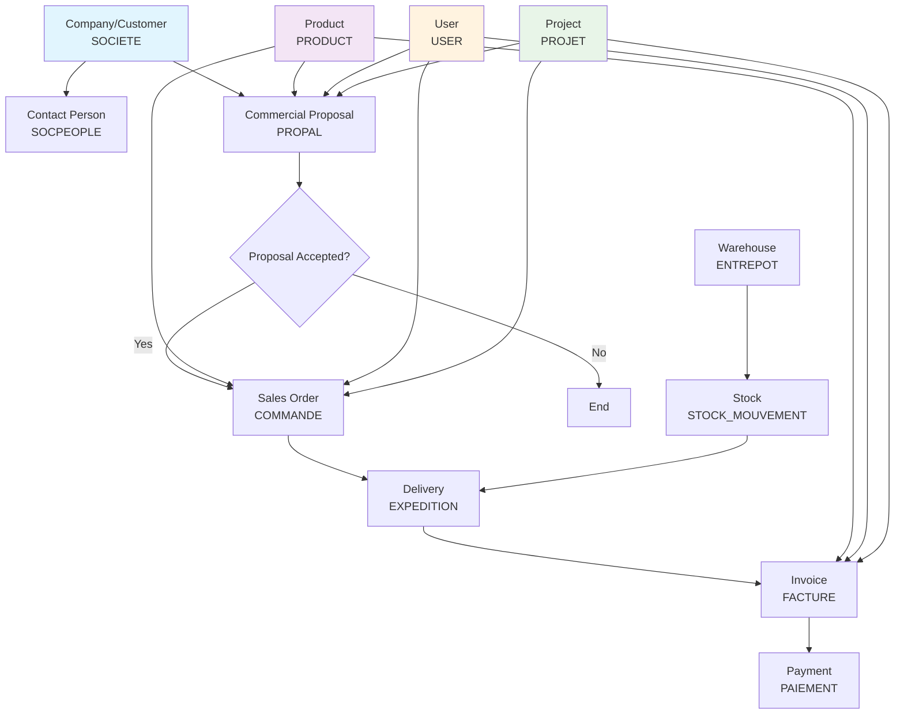

# Dolibarr Database Model Analysis

## Overview

This document provides a comprehensive analysis of the Dolibarr ERP/CRM database structure, including entity-relationship diagrams and detailed explanations of the core business entities and their relationships.

It describe the current configuration with list of module identified as enable in [module status](./modules-status.md) file

## Core Entity-Relationship Diagram

```mermaid
erDiagram
    %% Core Business Entities
    SOCIETE {
        int rowid PK
        string nom "Company name"
        string name_alias
        int entity FK
        string ref_ext
        tinyint statut
        int parent FK
        string code_client
        string code_fournisseur
        string address
        string zip
        string town
        int fk_departement FK
        int fk_pays FK
        string phone
        string email
        tinyint client "Is customer"
        tinyint fournisseur "Is supplier"
        datetime datec
        int fk_user_creat FK
        int fk_user_modif FK
    }

    USER {
        int rowid PK
        int entity FK
        string ref_employee
        smallint admin
        tinyint employee
        string login
        string pass_crypted
        string gender
        string lastname
        string firstname
        string address
        string zip
        string town
        int fk_country FK
        string office_phone
        string user_mobile
        string email
        int fk_soc FK
        int fk_socpeople FK
        datetime datec
        int fk_user_creat FK
        tinyint statut
    }

    SOCPEOPLE {
        int rowid PK
        int fk_soc FK
        int entity FK
        string ref_ext
        string name_alias
        string civility
        string lastname
        string firstname
        string address
        string zip
        string town
        int fk_departement FK
        int fk_pays FK
        string birthday
        string poste "Job position"
        string phone
        string phone_mobile
        string email
        tinyint statut
        datetime datec
        int fk_user_creat FK
    }

    PRODUCT {
        int rowid PK
        string ref
        int entity FK
        string ref_ext
        string label
        text description
        text note_public
        double price
        double price_ttc
        double cost_price
        double tva_tx "VAT rate"
        int fk_user_author FK
        tinyint tosell
        tinyint tobuy
        int fk_product_type FK
        float seuil_stock_alerte
        string barcode
        int fk_barcode_type FK
        float stock
        datetime datec
        tinyint hidden
    }

    FACTURE {
        int rowid PK
        string ref
        int entity FK
        string ref_ext
        string ref_client
        smallint type
        int fk_soc FK
        datetime datec
        date datef
        smallint paye "Paid status"
        double remise_percent
        double total_tva
        double total_ht
        double total_ttc
        smallint fk_statut FK
        int fk_user_author FK
        int fk_user_valid FK
        int fk_projet FK
        string fk_currency FK
        int fk_cond_reglement FK
        int fk_mode_reglement FK
        date date_lim_reglement
        text note_private
        text note_public
    }

    FACTUREDET {
        int rowid PK
        int fk_facture FK
        int fk_parent_line FK
        int fk_product FK
        string product_type
        text description
        string product_label
        double qty
        double subprice
        double remise_percent
        double tva_tx
        double localtax1_tx
        double localtax2_tx
        double total_ht
        double total_tva
        double total_ttc
        int rang "Line position"
    }

    COMMANDE {
        int rowid PK
        string ref
        int entity FK
        string ref_ext
        string ref_client
        int fk_soc FK
        int fk_projet FK
        datetime date_creation
        datetime date_valid
        date date_commande
        int fk_user_author FK
        int fk_user_valid FK
        smallint fk_statut FK
        double amount_ht
        double total_tva
        double total_ttc
        text note_private
        text note_public
        string fk_currency FK
        int fk_cond_reglement FK
        int fk_mode_reglement FK
        datetime date_livraison
        int fk_warehouse FK
    }

    COMMANDEDET {
        int rowid PK
        int fk_commande FK
        int fk_parent_line FK
        int fk_product FK
        string product_type
        text description
        double qty
        double subprice
        double remise_percent
        double tva_tx
        double total_ht
        double total_tva
        double total_ttc
        int rang "Line position"
        datetime date_start
        datetime date_end
    }

    PROPAL {
        int rowid PK
        string ref
        int entity FK
        string ref_ext
        string ref_client
        int fk_soc FK
        int fk_projet FK
        datetime datec
        datetime date_valid
        date datep "Proposal date"
        date fin_validite "Valid until"
        int fk_user_author FK
        int fk_user_valid FK
        smallint fk_statut FK
        double price
        double remise_percent
        double total_tva
        double total_ht
        double total_ttc
        text note_private
        text note_public
        string fk_currency FK
    }

    PROPALDET {
        int rowid PK
        int fk_propal FK
        int fk_parent_line FK
        int fk_product FK
        string product_type
        text description
        double qty
        double subprice
        double remise_percent
        double tva_tx
        double total_ht
        double total_tva
        double total_ttc
        int rang "Line position"
    }

    PROJET {
        int rowid PK
        int fk_soc FK
        string ref
        string title
        text description
        tinyint public
        smallint fk_statut FK
        int fk_user_creat FK
        datetime datec
        datetime date_start
        datetime date_end
        double budget_amount
        double usage_time
        double usage_bill_time
        text note_private
        text note_public
    }

    ACTIONCOMM {
        int rowid PK
        int fk_soc FK
        int fk_contact FK
        int fk_user_author FK
        int fk_user_action FK
        int fk_project FK
        string label
        datetime datep "Action date"
        datetime datef "End date"
        smallint fk_action FK
        int percent "Completion %"
        text note
        smallint fk_element FK
        int fk_element_id
    }

    STOCK_MOUVEMENT {
        int rowid PK
        int fk_product FK
        int fk_warehouse FK
        int fk_user FK
        string label
        datetime datem "Movement date"
        double value "Quantity"
        double price
        int type "Movement type"
        int fk_origin FK
        string origintype
        text note
    }

    ENTREPOT {
        int rowid PK
        string ref
        string label
        text description
        int statut
        string lieu "Location"
        string address
        string zip
        string ville
        int fk_pays FK
        int fk_user_author FK
        datetime datec
    }

    %% Categories
    CATEGORIE {
        int rowid PK
        int entity FK
        int fk_parent FK
        string label
        string ref_ext
        string color
        int position
        tinyint visible
        int type "Category type"
        text description
    }

    %% Configuration tables
    C_PAIEMENT {
        int rowid PK
        string code
        string libelle "Payment method"
        int type
        int active
        int accountancy_code
        string module
        int position
    }

    C_COND_REGLEMENT {
        int rowid PK
        string code
        string libelle "Payment terms"
        string libelle_facture
        int type
        int fdm "Days"
        int decalage "Offset"
        int active
        int entity FK
    }

    %% Relationships - Companies and Contacts
    SOCIETE ||--o{ SOCPEOPLE : "has contacts"
    SOCIETE ||--o{ USER : "has employees"
    SOCIETE ||--o{ FACTURE : "receives invoices"
    SOCIETE ||--o{ COMMANDE : "places orders"
    SOCIETE ||--o{ PROPAL : "receives proposals"
    SOCIETE ||--o{ PROJET : "owns projects"
    SOCIETE ||--o{ ACTIONCOMM : "has activities"
    
    USER ||--o{ SOCIETE : "creates"
    USER ||--o{ FACTURE : "creates invoices"
    USER ||--o{ COMMANDE : "creates orders"
    USER ||--o{ PROPAL : "creates proposals"
    USER ||--o{ PROJET : "creates projects"
    USER ||--o{ ACTIONCOMM : "performs activities"
    USER ||--o{ STOCK_MOUVEMENT : "manages stock"
    
    SOCPEOPLE }o--|| SOCIETE : "belongs to"
    
    %% Document relationships
    FACTURE ||--o{ FACTUREDET : "contains lines"
    COMMANDE ||--o{ COMMANDEDET : "contains lines"
    PROPAL ||--o{ PROPALDET : "contains lines"
    
    %% Product relationships
    PRODUCT ||--o{ FACTUREDET : "sold in"
    PRODUCT ||--o{ COMMANDEDET : "ordered in"
    PRODUCT ||--o{ PROPALDET : "proposed in"
    PRODUCT ||--o{ STOCK_MOUVEMENT : "moved in stock"
    
    %% Project relationships
    PROJET ||--o{ FACTURE : "generates invoices"
    PROJET ||--o{ COMMANDE : "generates orders"
    PROJET ||--o{ PROPAL : "generates proposals"
    PROJET ||--o{ ACTIONCOMM : "includes activities"
    
    %% Stock relationships
    ENTREPOT ||--o{ STOCK_MOUVEMENT : "contains movements"
    
    %% Configuration relationships
    C_PAIEMENT ||--o{ FACTURE : "payment method"
    C_COND_REGLEMENT ||--o{ FACTURE : "payment terms"
    C_COND_REGLEMENT ||--o{ COMMANDE : "payment terms"
    
    %% Category relationships (many-to-many via element_categorie)
    CATEGORIE ||--o{ SOCIETE : "categorizes companies"
    CATEGORIE ||--o{ PRODUCT : "categorizes products"
    CATEGORIE ||--o{ PROJET : "categorizes projects"
```



## Simplified Core Business Flow Diagram



## Entity Descriptions

### Core Business Entities

#### SOCIETE (Companies/Third Parties)
- **Purpose**: Central entity representing customers, suppliers, and prospects
- **Key Fields**: 
  - `nom`: Company name
  - `client/fournisseur`: Boolean flags for customer/supplier status
  - `code_client/code_fournisseur`: Unique customer/supplier codes
  - `address`, `zip`, `town`: Geographic information
- **Relationships**: Parent company to contacts, linked to all business documents

#### USER (System Users)
- **Purpose**: Represents system users (employees, administrators)
- **Key Fields**:
  - `login`: Authentication login
  - `admin`: Administrator flag
  - `employee`: Employee flag
  - `fk_soc`: Link to employer company
- **Relationships**: Creates and manages all business documents

#### SOCPEOPLE (Contacts)
- **Purpose**: Individual contacts within companies
- **Key Fields**:
  - `fk_soc`: Link to parent company
  - `lastname/firstname`: Personal identification
  - `poste`: Job position
  - `email/phone`: Communication details
- **Relationships**: Belongs to a company, linked to activities

#### PRODUCT (Products and Services)
- **Purpose**: Catalog of sellable/buyable items
- **Key Fields**:
  - `ref`: Product reference code
  - `label`: Product name
  - `price/price_ttc`: Pricing information
  - `stock`: Current stock level
  - `tosell/tobuy`: Availability flags
- **Relationships**: Used in proposals, orders, and invoices

### Document Entities

#### PROPAL (Commercial Proposals)
- **Purpose**: Sales quotations and proposals
- **Key Fields**:
  - `ref`: Proposal reference
  - `fk_soc`: Customer company
  - `datep`: Proposal date
  - `fin_validite`: Validity date
  - `fk_statut`: Status (draft, sent, accepted, refused)
- **Relationships**: Links to customer, contains proposal lines

#### COMMANDE (Sales Orders)
- **Purpose**: Confirmed customer orders
- **Key Fields**:
  - `ref`: Order reference
  - `fk_soc`: Customer company
  - `date_commande`: Order date
  - `date_livraison`: Delivery date
  - `fk_statut`: Order status
- **Relationships**: Generated from proposals, leads to deliveries

#### FACTURE (Invoices)
- **Purpose**: Customer billing documents
- **Key Fields**:
  - `ref`: Invoice reference
  - `fk_soc`: Customer company
  - `datef`: Invoice date
  - `date_lim_reglement`: Payment due date
  - `paye`: Payment status
  - `total_ht/total_ttc`: Amounts excluding/including tax
- **Relationships**: Generated from orders, linked to payments

### Supporting Entities

#### PROJET (Projects)
- **Purpose**: Project management and tracking
- **Key Fields**:
  - `ref`: Project reference
  - `title`: Project name
  - `fk_soc`: Client company
  - `budget_amount`: Allocated budget
  - `date_start/date_end`: Project timeline
- **Relationships**: Links to all related business documents

#### ACTIONCOMM (Activities/Events)
- **Purpose**: CRM activities and communications tracking
- **Key Fields**:
  - `label`: Activity description
  - `datep/datef`: Activity timeframe
  - `fk_soc`: Related company
  - `fk_contact`: Related contact
  - `percent`: Completion percentage
- **Relationships**: Links to companies, contacts, and projects

#### STOCK_MOUVEMENT (Stock Movements)
- **Purpose**: Inventory tracking and movements
- **Key Fields**:
  - `fk_product`: Product moved
  - `fk_warehouse`: Storage location
  - `value`: Quantity moved
  - `datem`: Movement date
  - `type`: Movement type (in/out/transfer)
- **Relationships**: Links products to warehouses with movement history

## Key Relationships and Business Rules

### 1. Customer-Centric Flow
```
Company (SOCIETE) → Contact (SOCPEOPLE) → Proposal (PROPAL) → Order (COMMANDE) → Invoice (FACTURE) → Payment
```

### 2. Product Management
```
Product (PRODUCT) → Stock Movements (STOCK_MOUVEMENT) ↔ Warehouse (ENTREPOT)
```

### 3. Document Lifecycle
- **Proposals** can be converted to **Orders**
- **Orders** generate **Deliveries** and **Invoices**
- **Invoices** track **Payments**
- All documents can reference **Projects**

### 4. User and Permission Model
- **Users** belong to **Companies** (as employees)
- **Users** create and manage all business documents
- **Admin users** have system-wide permissions
- **Regular users** have entity-based permissions

### 5. Multi-Entity Support
- Most entities have an `entity` field for multi-company setups
- Enables SaaS-style deployment with data isolation
- Users can be restricted to specific entities

## Configuration and Reference Data

The database includes numerous configuration tables (prefixed with `c_`) that provide:
- **Payment methods** (`c_paiement`)
- **Payment terms** (`c_cond_reglement`)
- **Countries and regions** (`c_country`, `c_regions`, `c_departements`)
- **Currencies** (`c_currencies`)
- **Tax rates** (`c_tva`)
- **Product types** (`c_product_nature`)
- **Document statuses** for various entities

## Extensibility Features

### 1. Extra Fields
- Most entities have corresponding `*_extrafields` tables
- Allows custom field additions without schema changes
- Supports various field types (text, number, date, list, etc.)

### 2. Categories
- Flexible categorization system via `CATEGORIE` entity
- Supports hierarchical categories
- Can categorize companies, products, projects, etc.

### 3. Multi-currency Support
- Native multi-currency handling in documents
- Exchange rate tracking
- Multi-currency reporting capabilities

### 4. Modular Design
- Database structure supports Dolibarr's modular architecture
- Tables can be enabled/disabled based on active modules
- Clean separation of concerns between business domains

This database model provides a comprehensive foundation for ERP/CRM operations, supporting the complete business cycle from lead generation through payment collection, while maintaining flexibility for customization and multi-entity deployments.
