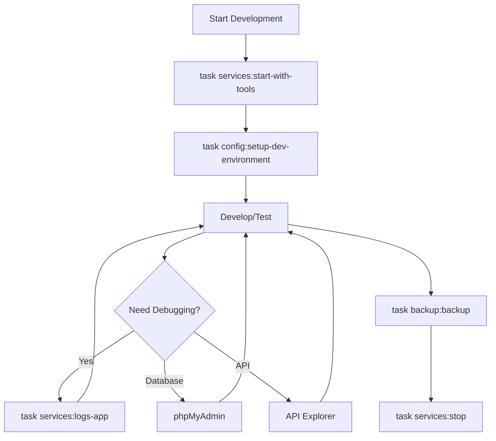
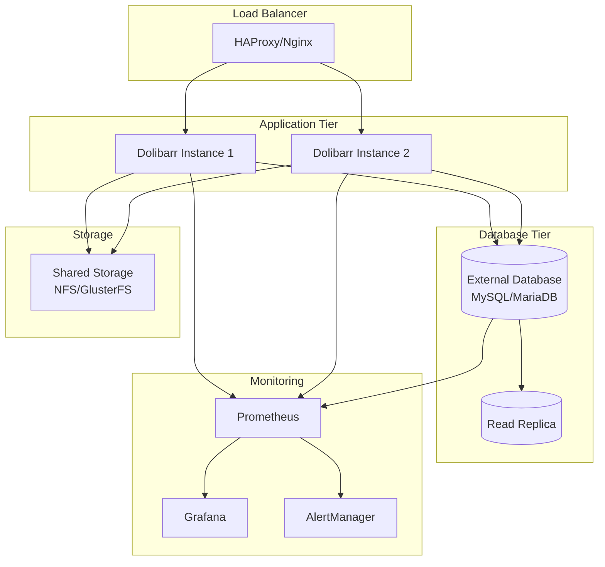
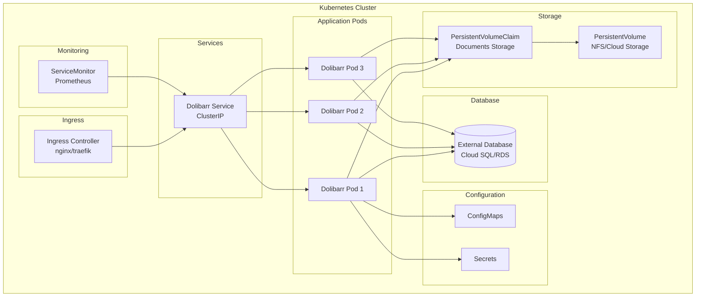

# Dolibarr Deployment Scenarios

This document outlines various deployment scenarios for the Dolibarr Docker setup, from development environments to production deployments across different infrastructure types.

## Quick Reference

| Scenario | Profile | Database | Complexity | Use Case |
|----------|---------|----------|------------|----------|
| [Local Development](#local-development) | `internal-db-tools` | Internal | 🟢 Low | Testing, module development |
| [Small Business](#small-business-production) | `internal-db` | Internal | 🟡 Medium | Single-site deployment |
| [Enterprise Production](#enterprise-production) | `external-db` | External | 🔴 High | Multi-user, high availability |
| [Multi-Environment](#multi-environment-setup) | Various | External | 🔴 High | Dev/Staging/Prod pipeline |
| [Cloud Deployment](#cloud-deployment) | `external-db` | Cloud | 🔴 High | Scalable cloud infrastructure |
| [Kubernetes Helm](#kubernetes-helm-deployment) | `external-db` | External | 🔴 High | Kubernetes orchestration |

## Local Development

### Scenario Overview

**Perfect for**: Developers, module testing, API development, learning Dolibarr.

**Characteristics**:
- Single developer machine
- Full tooling access (phpMyAdmin)
- Demo data for testing
- API enabled for development

### Quick Setup

```bash
# Clone and setup
git clone <repository> dolibarr-dev
cd dolibarr-dev

# Initialize environment
task setup:init

# Start with all development tools
task services:start-with-tools

# Setup development environment with demo data
task config:setup-dev-environment

# Verify setup
task utilities:health
task config:show-config
```

### Development Environment Configuration

```env
# .env for development
DOLIBARR_PORT=18080
PHPMYADMIN_PORT=18081
DB_EXTERNAL_PORT=13306

# Development-friendly passwords
DB_PASSWORD=dev-password
DB_ROOT_PASSWORD=dev-root-password
DOLIBARR_ADMIN_PASSWORD=admin123

# Development settings
TIMEZONE=America/New_York
```

### Access Points

| Service | URL | Purpose |
|---------|-----|---------|
| Dolibarr | http://localhost:18080 | Main application |
| phpMyAdmin | http://localhost:18081 | Database management |
| API Explorer | http://localhost:18080/api/index.php/explorer | API testing |

### Development Workflow



### Custom Module Development

```bash
# Module development structure
./custom/
├── mymodule/
│   ├── core/
│   ├── admin/
│   └── class/
└── README.md

# Test custom module
# 1. Place module in ./custom/mymodule/
# 2. Restart services
task services:stop
task services:start-with-tools

# 3. Enable in Dolibarr interface
# Home → Setup → Modules/Applications
```

## Small Business Production

### Scenario Overview

**Perfect for**: Small businesses (1-20 users), single office, straightforward deployment.

**Characteristics**:
- Internal database for simplicity
- Basic security configurations
- Automated backups
- Minimal complexity

### Production Setup

```bash
# Production environment setup
git clone <repository> dolibarr-production
cd dolibarr-production

# Configure for production
cp .env.example .env
# Edit .env with production settings

# Start production services
task services:start

# Configure for business use
task config:configure-company
task config:enable-modules

# Setup regular backups
# Add to crontab:
# 0 2 * * * cd /path/to/dolibarr-production && task backup:backup
```

### Production Environment Configuration

```env
# .env for small business production
DOLIBARR_PORT=8080
# Don't expose phpMyAdmin in production
# PHPMYADMIN_PORT=8081

# Strong passwords
DB_PASSWORD=your-very-secure-password-here
DB_ROOT_PASSWORD=your-very-secure-root-password
DOLIBARR_ADMIN_PASSWORD=your-admin-password

# Company settings
DOLIBARR_ADMIN_LOGIN=admin
TIMEZONE=Europe/Paris
```

### Security Hardening

```bash
# Remove development tools
# Don't use --profile internal-db-tools

# Regular updates
task maintenance:update

# Monitor logs
task services:logs-app | tail -f

# Regular health checks
task utilities:health
```

### Backup Strategy

```bash
#!/bin/bash
# backup-script.sh - Add to cron

cd /path/to/dolibarr-production

# Daily backup
task backup:backup

# Weekly cleanup - keep last 4 weeks
find ./backups/ -name "*.tar.gz" -mtime +28 -delete
find ./backups/ -name "*.sql.gz" -mtime +28 -delete

# Email notification (optional)
echo "Dolibarr backup completed $(date)" | mail -s "Backup Status" admin@company.com
```

### Reverse Proxy Setup (Nginx)

```nginx
# /etc/nginx/sites-available/dolibarr
server {
    listen 80;
    server_name dolibarr.yourcompany.com;
    
    # Redirect to HTTPS
    return 301 https://$server_name$request_uri;
}

server {
    listen 443 ssl http2;
    server_name dolibarr.yourcompany.com;
    
    # SSL configuration
    ssl_certificate /path/to/certificate.crt;
    ssl_certificate_key /path/to/private.key;
    
    # Security headers
    add_header X-Frame-Options DENY;
    add_header X-Content-Type-Options nosniff;
    add_header X-XSS-Protection "1; mode=block";
    
    location / {
        proxy_pass http://localhost:8080;
        proxy_set_header Host $host;
        proxy_set_header X-Real-IP $remote_addr;
        proxy_set_header X-Forwarded-For $proxy_add_x_forwarded_for;
        proxy_set_header X-Forwarded-Proto $scheme;
        
        # File upload size
        client_max_body_size 100M;
    }
}
```

## Enterprise Production

### Scenario Overview

**Perfect for**: Medium to large businesses (20+ users), high availability requirements, compliance needs.

**Characteristics**:
- External database (managed or dedicated)
- High availability setup
- Advanced monitoring
- Security compliance
- Multi-environment support

### Architecture



### High Availability Setup

```bash
# Node 1 setup
git clone <repository> /opt/dolibarr-node1
cd /opt/dolibarr-node1

# Configure for HA
cp .env.example .env
# Configure with external database and shared storage

# Start services
task services:start-external

# Configure application
task config:configure-company
task config:enable-modules
```

### External Database Configuration

```env
# .env for enterprise production
# Application
DOLIBARR_PORT=8080
TIMEZONE=UTC

# External Database
DB_HOST=mysql.company.internal
DB_PORT=3306
DB_NAME=dolibarr_prod
DB_USER=dolibarr_user
DB_PASSWORD=${DB_PASSWORD}  # From secrets management
DB_ROOT_PASSWORD=           # Not needed for external DB

# Admin user
DOLIBARR_ADMIN_LOGIN=admin
DOLIBARR_ADMIN_PASSWORD=${ADMIN_PASSWORD}  # From secrets management

# File storage
# Mount shared storage to ./documents/
```

### Docker Compose Override for HA

```yaml
# docker-compose.override.yml
version: '3.8'

services:
  dolibarr:
    volumes:
      # Shared storage for documents
      - /mnt/shared-storage/documents:/var/www/documents
      - /mnt/shared-storage/html:/var/www/html
    environment:
      # Additional environment variables
      - DOLI_DB_HOST=${DB_HOST}
      - DOLI_DB_PORT=${DB_PORT}
    labels:
      # Labels for monitoring
      - "prometheus.io/scrape=true"
      - "prometheus.io/port=8080"
    logging:
      driver: "json-file"
      options:
        max-size: "10m"
        max-file: "3"
```

### Monitoring Setup

```yaml
# monitoring/docker-compose.yml
version: '3.8'

services:
  prometheus:
    image: prom/prometheus:latest
    ports:
      - "9090:9090"
    volumes:
      - ./prometheus.yml:/etc/prometheus/prometheus.yml
      - prometheus-data:/prometheus
    
  grafana:
    image: grafana/grafana:latest
    ports:
      - "3000:3000"
    environment:
      - GF_SECURITY_ADMIN_PASSWORD=admin
    volumes:
      - grafana-data:/var/lib/grafana
      - ./grafana-dashboards:/var/lib/grafana/dashboards

volumes:
  prometheus-data:
  grafana-data:
```

## Multi-Environment Setup

### Scenario Overview

**Perfect for**: Development teams, CI/CD pipelines, staged deployments.

**Characteristics**:
- Separate dev/staging/production environments
- Environment-specific configurations
- Data migration between environments
- Automated deployments

### Environment Structure

```bash
# Directory structure
company-dolibarr/
├── environments/
│   ├── development/
│   │   ├── docker-compose.yml
│   │   ├── .env
│   │   └── custom/
│   ├── staging/
│   │   ├── docker-compose.yml
│   │   ├── .env
│   │   └── backups/
│   └── production/
│       ├── docker-compose.yml
│       ├── .env
│       ├── backups/
│       └── custom/
├── shared/
│   ├── modules/
│   └── scripts/
└── ci-cd/
    ├── deploy.sh
    └── migrate.sh
```

### Environment-Specific Configuration

```bash
# Development environment
cd environments/development
cat > .env << EOF
DOLIBARR_PORT=18080
PHPMYADMIN_PORT=18081
DB_PASSWORD=dev-password
DB_ROOT_PASSWORD=dev-root-password
DOLIBARR_ADMIN_PASSWORD=admin123
ENVIRONMENT=development
EOF

# Staging environment
cd ../staging
cat > .env << EOF
DOLIBARR_PORT=28080
DB_HOST=staging-db.company.internal
DB_PASSWORD=${STAGING_DB_PASSWORD}
DOLIBARR_ADMIN_PASSWORD=${STAGING_ADMIN_PASSWORD}
ENVIRONMENT=staging
EOF

# Production environment
cd ../production
cat > .env << EOF
DOLIBARR_PORT=8080
DB_HOST=prod-db.company.internal
DB_PASSWORD=${PROD_DB_PASSWORD}
DOLIBARR_ADMIN_PASSWORD=${PROD_ADMIN_PASSWORD}
ENVIRONMENT=production
EOF
```

### Deployment Pipeline

```bash
#!/bin/bash
# ci-cd/deploy.sh

ENVIRONMENT=$1
TARGET_DIR="environments/$ENVIRONMENT"

if [ ! -d "$TARGET_DIR" ]; then
    echo "Environment $ENVIRONMENT not found"
    exit 1
fi

cd "$TARGET_DIR"

echo "Deploying to $ENVIRONMENT environment..."

# Backup current state (staging/production only)
if [ "$ENVIRONMENT" != "development" ]; then
    task backup:backup
fi

# Deploy based on environment
case $ENVIRONMENT in
    "development")
        task services:start-with-tools
        task config:setup-dev-environment
        ;;
    "staging")
        task services:start-external
        task config:configure-company
        task config:enable-modules
        ;;
    "production")
        task services:start-external
        task config:configure-company
        task config:enable-modules
        # Additional production steps
        task utilities:health
        ;;
esac

echo "Deployment to $ENVIRONMENT completed"
```

### Data Migration Between Environments

```bash
#!/bin/bash
# ci-cd/migrate.sh

SOURCE_ENV=$1
TARGET_ENV=$2

echo "Migrating data from $SOURCE_ENV to $TARGET_ENV"

# Create backup from source
cd "environments/$SOURCE_ENV"
task backup:backup-db
BACKUP_FILE=$(ls -t backups/*.sql.gz | head -1)

# Restore to target
cd "../$TARGET_ENV"
task backup:restore-db BACKUP_FILE="../../$SOURCE_ENV/$BACKUP_FILE"

# Update environment-specific data
docker-compose exec dolibarr php -r "
require_once '/var/www/html/master.inc.php';
// Update company information for target environment
dolibarr_set_const(\$db, 'MAIN_INFO_SOCIETE_NOM', '$TARGET_ENV Environment', 'chaine', 0, '', 0);
"

echo "Migration completed"
```

## Cloud Deployment

### Scenario Overview

**Perfect for**: Scalable deployments, global access, managed infrastructure.

**Characteristics**:
- Cloud-native architecture
- Auto-scaling capabilities
- Managed database services
- Container orchestration (Kubernetes)

### AWS Deployment

#### ECS with RDS

```json
{
  "taskDefinition": {
    "family": "dolibarr-app",
    "networkMode": "awsvpc",
    "requiresCompatibilities": ["FARGATE"],
    "cpu": "512",
    "memory": "1024",
    "executionRoleArn": "arn:aws:iam::account:role/ecsTaskExecutionRole",
    "taskRoleArn": "arn:aws:iam::account:role/ecsTaskRole",
    "containerDefinitions": [
      {
        "name": "dolibarr",
        "image": "dolibarr/dolibarr:latest",
        "portMappings": [
          {
            "containerPort": 80,
            "protocol": "tcp"
          }
        ],
        "environment": [
          {
            "name": "DOLI_DB_HOST",
            "value": "dolibarr-db.cluster-xyz.us-west-2.rds.amazonaws.com"
          },
          {
            "name": "DOLI_DB_NAME",
            "value": "dolibarr"
          }
        ],
        "secrets": [
          {
            "name": "DOLI_DB_PASSWORD",
            "valueFrom": "arn:aws:secretsmanager:us-west-2:account:secret:dolibarr-db-password"
          }
        ],
        "logConfiguration": {
          "logDriver": "awslogs",
          "options": {
            "awslogs-group": "/ecs/dolibarr",
            "awslogs-region": "us-west-2",
            "awslogs-stream-prefix": "ecs"
          }
        }
      }
    ]
  }
}
```

### Kubernetes Deployment

```yaml
# k8s/namespace.yaml
apiVersion: v1
kind: Namespace
metadata:
  name: dolibarr
---
# k8s/deployment.yaml
apiVersion: apps/v1
kind: Deployment
metadata:
  name: dolibarr
  namespace: dolibarr
spec:
  replicas: 3
  selector:
    matchLabels:
      app: dolibarr
  template:
    metadata:
      labels:
        app: dolibarr
    spec:
      containers:
      - name: dolibarr
        image: dolibarr/dolibarr:latest
        ports:
        - containerPort: 80
        env:
        - name: DOLI_DB_HOST
          value: "mysql-service"
        - name: DOLI_DB_NAME
          value: "dolibarr"
        - name: DOLI_DB_USER
          valueFrom:
            secretKeyRef:
              name: db-credentials
              key: username
        - name: DOLI_DB_PASSWORD
          valueFrom:
            secretKeyRef:
              name: db-credentials
              key: password
        volumeMounts:
        - name: dolibarr-documents
          mountPath: /var/www/documents
        resources:
          requests:
            memory: "512Mi"
            cpu: "250m"
          limits:
            memory: "1Gi"
            cpu: "500m"
      volumes:
      - name: dolibarr-documents
        persistentVolumeClaim:
          claimName: dolibarr-documents-pvc
---
# k8s/service.yaml
apiVersion: v1
kind: Service
metadata:
  name: dolibarr-service
  namespace: dolibarr
spec:
  selector:
    app: dolibarr
  ports:
  - protocol: TCP
    port: 80
    targetPort: 80
  type: LoadBalancer
---
# k8s/ingress.yaml
apiVersion: networking.k8s.io/v1
kind: Ingress
metadata:
  name: dolibarr-ingress
  namespace: dolibarr
  annotations:
    nginx.ingress.kubernetes.io/ssl-redirect: "true"
    cert-manager.io/cluster-issuer: "letsencrypt-prod"
spec:
  tls:
  - hosts:
    - dolibarr.company.com
    secretName: dolibarr-tls
  rules:
  - host: dolibarr.company.com
    http:
      paths:
      - path: /
        pathType: Prefix
        backend:
          service:
            name: dolibarr-service
            port:
              number: 80
```

### Google Cloud Platform Deployment

#### Cloud Run

```yaml
# cloudbuild.yaml
steps:
  - name: 'gcr.io/cloud-builders/docker'
    args: ['build', '-t', 'gcr.io/$PROJECT_ID/dolibarr:$COMMIT_SHA', '.']
  - name: 'gcr.io/cloud-builders/docker'
    args: ['push', 'gcr.io/$PROJECT_ID/dolibarr:$COMMIT_SHA']
  - name: 'gcr.io/google.com/cloudsdktool/cloud-sdk'
    entrypoint: gcloud
    args:
    - 'run'
    - 'deploy'
    - 'dolibarr'
    - '--image'
    - 'gcr.io/$PROJECT_ID/dolibarr:$COMMIT_SHA'
    - '--region'
    - 'us-central1'
    - '--platform'
    - 'managed'
    - '--set-env-vars'
    - 'DOLI_DB_HOST=${_DB_HOST},DOLI_DB_NAME=${_DB_NAME}'
    - '--set-secrets'
    - 'DOLI_DB_PASSWORD=dolibarr-db-password:latest'
```

## Kubernetes Helm Deployment

### Scenario Overview

**Perfect for**: Kubernetes-native deployments, enterprise environments, GitOps workflows, scalable production systems.

**Characteristics**:
- Kubernetes-native deployment with Helm charts
- Production-ready configurations
- Auto-scaling and high availability
- Integrated with cloud provider services
- Simplified deployment and upgrades
- Configuration management through values

### Architecture



### Quick Helm Deployment

```bash
# Add the Helm repository
helm repo add cowboysysop https://cowboysysop.github.io/charts/
helm repo update

# Create namespace
kubectl create namespace dolibarr

# Deploy with basic configuration
helm install dolibarr cowboysysop/dolibarr \
  --namespace dolibarr \
  --set dolibarr.host=dolibarr.yourdomain.com \
  --set mysql.auth.password=your-secure-password

# Check deployment status
kubectl get pods -n dolibarr
helm status dolibarr -n dolibarr
```

### Production Values Configuration

Create a comprehensive `values-production.yaml` file:

```yaml
# values-production.yaml
# Production configuration for Dolibarr Helm chart

# Global settings
global:
  storageClass: "fast-ssd"  # Use appropriate storage class

# Dolibarr application configuration
dolibarr:
  # Application settings
  host: dolibarr.company.com
  username: admin
  password: "your-admin-password"  # Better to use external secrets
  
  # Database connection
  externalDatabase:
    enabled: true
    host: "dolibarr-db.cluster-xyz.region.rds.amazonaws.com"
    port: 3306
    database: dolibarr_prod
    username: dolibarr_user
    password: "your-db-password"  # Use external secrets
    
  # Application configuration
  configuration: |
    <?php
    // Custom Dolibarr configuration
    $dolibarr_main_url_root='https://dolibarr.company.com';
    $dolibarr_main_document_root='/var/www/html';
    $dolibarr_main_url_root_alt='/custom';
    $dolibarr_main_document_root_alt='/var/www/html/custom';
    $dolibarr_main_prod=1;
    $dolibarr_main_force_https=1;
    $dolibarr_main_restrict_os_commands=1;
    $dolibarr_nocsrfcheck=0;
    
# Deployment configuration
replicaCount: 3

image:
  repository: dolibarr/dolibarr
  tag: "20.0.0"  # Pin to specific version
  pullPolicy: IfNotPresent

# Service configuration
service:
  type: ClusterIP
  port: 80
  
# Ingress configuration
ingress:
  enabled: true
  className: "nginx"  # or "traefik"
  annotations:
    nginx.ingress.kubernetes.io/ssl-redirect: "true"
    nginx.ingress.kubernetes.io/force-ssl-redirect: "true"
    nginx.ingress.kubernetes.io/proxy-body-size: "100m"
    cert-manager.io/cluster-issuer: "letsencrypt-prod"
  hosts:
    - host: dolibarr.company.com
      paths:
        - path: /
          pathType: Prefix
  tls:
    - secretName: dolibarr-tls
      hosts:
        - dolibarr.company.com

# Resource limits and requests
resources:
  limits:
    cpu: 1000m
    memory: 2Gi
  requests:
    cpu: 250m
    memory: 512Mi

# Horizontal Pod Autoscaler
autoscaling:
  enabled: true
  minReplicas: 3
  maxReplicas: 10
  targetCPUUtilizationPercentage: 70
  targetMemoryUtilizationPercentage: 80

# Pod Disruption Budget
podDisruptionBudget:
  enabled: true
  minAvailable: 2

# Persistence configuration
persistence:
  enabled: true
  storageClass: "fast-ssd"
  size: 100Gi
  accessModes:
    - ReadWriteMany  # Required for multi-pod access
    
# Security context
securityContext:
  runAsNonRoot: true
  runAsUser: 1000
  fsGroup: 1000
  
podSecurityContext:
  seccompProfile:
    type: RuntimeDefault

# Probes configuration
livenessProbe:
  httpGet:
    path: /
    port: http
  initialDelaySeconds: 60
  periodSeconds: 30
  timeoutSeconds: 10
  failureThreshold: 3
  
readinessProbe:
  httpGet:
    path: /
    port: http
  initialDelaySeconds: 30
  periodSeconds: 10
  timeoutSeconds: 5
  failureThreshold: 3

# MySQL configuration (if using internal database)
mysql:
  enabled: false  # Using external database
  
# MariaDB configuration (alternative)
mariadb:
  enabled: false  # Using external database
  
# ServiceMonitor for Prometheus
serviceMonitor:
  enabled: true
  labels:
    app: dolibarr
  interval: 30s
  scrapeTimeout: 10s

# Pod annotations for monitoring
podAnnotations:
  prometheus.io/scrape: "true"
  prometheus.io/port: "80"
  prometheus.io/path: "/"

# Node selector for specific nodes
nodeSelector:
  workload-type: application

# Tolerations
tolerations:
  - key: "application-workload"
    operator: "Equal"
    value: "true"
    effect: "NoSchedule"

# Affinity rules
affinity:
  podAntiAffinity:
    preferredDuringSchedulingIgnoredDuringExecution:
      - weight: 100
        podAffinityTerm:
          labelSelector:
            matchExpressions:
              - key: app.kubernetes.io/name
                operator: In
                values:
                  - dolibarr
          topologyKey: kubernetes.io/hostname

# Environment variables
env:
  - name: DOLI_DB_TYPE
    value: "mysqli"
  - name: DOLI_DB_HOST
    value: "dolibarr-db.cluster-xyz.region.rds.amazonaws.com"
  - name: DOLI_DB_NAME
    value: "dolibarr_prod"
  - name: DOLI_DB_USER
    valueFrom:
      secretKeyRef:
        name: dolibarr-db-secret
        key: username
  - name: DOLI_DB_PASSWORD
    valueFrom:
      secretKeyRef:
        name: dolibarr-db-secret
        key: password
  - name: DOLI_ADMIN_LOGIN
    value: "admin"
  - name: DOLI_ADMIN_PASSWORD
    valueFrom:
      secretKeyRef:
        name: dolibarr-admin-secret
        key: password
  - name: DOLI_URL_ROOT
    value: "https://dolibarr.company.com"
  - name: PHP_INI_DATE_TIMEZONE
    value: "UTC"
  - name: PHP_INI_MEMORY_LIMIT
    value: "512M"
  - name: PHP_INI_UPLOAD_MAX_FILESIZE
    value: "100M"
  - name: PHP_INI_POST_MAX_SIZE
    value: "100M"
```

### External Secrets Management

For production deployments, use external secrets management:

```yaml
# secrets.yaml
apiVersion: v1
kind: Secret
metadata:
  name: dolibarr-db-secret
  namespace: dolibarr
type: Opaque
data:
  username: ZG9saWJhcnJfdXNlcg==  # base64 encoded
  password: eW91ci1zZWN1cmUtZGItcGFzc3dvcmQ=  # base64 encoded
---
apiVersion: v1
kind: Secret
metadata:
  name: dolibarr-admin-secret
  namespace: dolibarr
type: Opaque
data:
  password: eW91ci1hZG1pbi1wYXNzd29yZA==  # base64 encoded
```

Or use External Secrets Operator with cloud providers:

```yaml
# external-secret.yaml
apiVersion: external-secrets.io/v1beta1
kind: ExternalSecret
metadata:
  name: dolibarr-secrets
  namespace: dolibarr
spec:
  refreshInterval: 1m
  secretStoreRef:
    name: aws-secrets-store
    kind: SecretStore
  target:
    name: dolibarr-db-secret
    creationPolicy: Owner
  data:
  - secretKey: username
    remoteRef:
      key: dolibarr/database
      property: username
  - secretKey: password
    remoteRef:
      key: dolibarr/database
      property: password
```

### Production Deployment

```bash
# Create namespace
kubectl create namespace dolibarr

# Create secrets (if not using external secrets)
kubectl apply -f secrets.yaml

# Deploy with production values
helm install dolibarr cowboysysop/dolibarr \
  --namespace dolibarr \
  --values values-production.yaml

# Verify deployment
kubectl get pods -n dolibarr
kubectl get ingress -n dolibarr
kubectl get pvc -n dolibarr

# Check application logs
kubectl logs -f deployment/dolibarr -n dolibarr
```

### Monitoring and Observability

Configure monitoring with Prometheus and Grafana:

```yaml
# monitoring-values.yaml
# Additional values for monitoring

serviceMonitor:
  enabled: true
  labels:
    release: prometheus
  interval: 30s
  scrapeTimeout: 10s
  path: /admin/system/phpmemory.php
  
podAnnotations:
  prometheus.io/scrape: "true"
  prometheus.io/port: "80"
  prometheus.io/path: "/admin/system/phpmemory.php"

# Grafana dashboard ConfigMap
---
apiVersion: v1
kind: ConfigMap
metadata:
  name: dolibarr-dashboard
  namespace: monitoring
  labels:
    grafana_dashboard: "1"
data:
  dolibarr.json: |
    {
      "dashboard": {
        "title": "Dolibarr Monitoring",
        "panels": [
          {
            "title": "Response Time",
            "type": "graph",
            "targets": [
              {
                "expr": "histogram_quantile(0.95, http_request_duration_seconds_bucket{job=\"dolibarr\"})"
              }
            ]
          },
          {
            "title": "Memory Usage",
            "type": "graph",
            "targets": [
              {
                "expr": "container_memory_usage_bytes{pod=~\"dolibarr-.*\"}"
              }
            ]
          },
          {
            "title": "CPU Usage",
            "type": "graph",
            "targets": [
              {
                "expr": "rate(container_cpu_usage_seconds_total{pod=~\"dolibarr-.*\"}[5m])"
              }
            ]
          }
        ]
      }
    }
```

### GitOps with ArgoCD

For GitOps deployment with ArgoCD:

```yaml
# argocd-application.yaml
apiVersion: argoproj.io/v1alpha1
kind: Application
metadata:
  name: dolibarr-prod
  namespace: argocd
spec:
  project: default
  source:
    repoURL: https://cowboysysop.github.io/charts/
    chart: dolibarr
    targetRevision: 8.0.0
    helm:
      valueFiles:
        - values-production.yaml
      parameters:
        - name: dolibarr.host
          value: dolibarr.company.com
        - name: replicaCount
          value: "3"
  destination:
    server: https://kubernetes.default.svc
    namespace: dolibarr
  syncPolicy:
    automated:
      prune: true
      selfHeal: true
      allowEmpty: false
    syncOptions:
      - CreateNamespace=true
      - PrunePropagationPolicy=foreground
      - PruneLast=true
    retry:
      limit: 3
      backoff:
        duration: 5s
        factor: 2
        maxDuration: 3m
```

### Backup Strategy for Kubernetes

```bash
#!/bin/bash
# k8s-backup.sh

NAMESPACE="dolibarr"
BACKUP_DIR="/backups/$(date +%Y%m%d_%H%M%S)"

# Create backup directory
mkdir -p "$BACKUP_DIR"

# Backup database (assuming external RDS)
echo "Creating database backup..."
kubectl run mysql-backup --rm -it --restart=Never \
  --image=mysql:8.0 -- \
  mysqldump -h dolibarr-db.cluster-xyz.region.rds.amazonaws.com \
  -u dolibarr_user -p dolibarr_prod > "$BACKUP_DIR/database.sql"

# Backup persistent volumes
echo "Creating PV backup..."
kubectl get pvc -n "$NAMESPACE" -o yaml > "$BACKUP_DIR/pvc-backup.yaml"

# Backup application configuration
echo "Creating configuration backup..."
kubectl get configmaps -n "$NAMESPACE" -o yaml > "$BACKUP_DIR/configmaps.yaml"
kubectl get secrets -n "$NAMESPACE" -o yaml > "$BACKUP_DIR/secrets.yaml"
helm get values dolibarr -n "$NAMESPACE" > "$BACKUP_DIR/helm-values.yaml"

# Compress backup
tar -czf "$BACKUP_DIR.tar.gz" -C "$BACKUP_DIR" .
rm -rf "$BACKUP_DIR"

echo "Backup completed: $BACKUP_DIR.tar.gz"
```

### Disaster Recovery

```bash
#!/bin/bash
# k8s-restore.sh

BACKUP_FILE=$1
NAMESPACE="dolibarr"

if [ -z "$BACKUP_FILE" ]; then
    echo "Usage: $0 <backup-file.tar.gz>"
    exit 1
fi

# Extract backup
RESTORE_DIR="/tmp/restore_$(date +%Y%m%d_%H%M%S)"
mkdir -p "$RESTORE_DIR"
tar -xzf "$BACKUP_FILE" -C "$RESTORE_DIR"

# Restore database
echo "Restoring database..."
kubectl run mysql-restore --rm -it --restart=Never \
  --image=mysql:8.0 -- \
  mysql -h dolibarr-db.cluster-xyz.region.rds.amazonaws.com \
  -u dolibarr_user -p dolibarr_prod < "$RESTORE_DIR/database.sql"

# Restore configuration
echo "Restoring configuration..."
kubectl apply -f "$RESTORE_DIR/configmaps.yaml"
kubectl apply -f "$RESTORE_DIR/secrets.yaml"

# Restore application
echo "Restoring application..."
helm upgrade --install dolibarr cowboysysop/dolibarr \
  --namespace "$NAMESPACE" \
  --values "$RESTORE_DIR/helm-values.yaml"

# Cleanup
rm -rf "$RESTORE_DIR"

echo "Restore completed"
```

### Upgrade Strategy

```bash
#!/bin/bash
# helm-upgrade.sh

NAMESPACE="dolibarr"
RELEASE_NAME="dolibarr"
CHART_VERSION="8.0.0"  # Target version

echo "Starting Dolibarr upgrade..."

# Backup current state
./k8s-backup.sh

# Update Helm repo
helm repo update cowboysysop

# Perform upgrade
helm upgrade "$RELEASE_NAME" cowboysysop/dolibarr \
  --namespace "$NAMESPACE" \
  --version "$CHART_VERSION" \
  --values values-production.yaml \
  --wait --timeout=10m

# Verify upgrade
kubectl rollout status deployment/dolibarr -n "$NAMESPACE"
kubectl get pods -n "$NAMESPACE"

# Health check
echo "Performing health check..."
kubectl run health-check --rm -it --restart=Never \
  --image=curlimages/curl -- \
  curl -f -s http://dolibarr-service.dolibarr.svc.cluster.local/

echo "Upgrade completed successfully"
```

### Multi-Environment Management

Manage multiple environments with different values files:

```bash
# Directory structure
k8s-dolibarr/
├── charts/
├── environments/
│   ├── development/
│   │   └── values.yaml
│   ├── staging/
│   │   └── values.yaml
│   └── production/
│       └── values.yaml
├── scripts/
│   ├── deploy.sh
│   └── backup.sh
└── monitoring/
    └── dashboards/

# Deploy to specific environment
./scripts/deploy.sh production
./scripts/deploy.sh staging
./scripts/deploy.sh development
```

### Helm Chart Customization

If you need to customize the Helm chart:

```bash
# Pull the chart for customization
helm pull cowboysysop/dolibarr --untar

# Modify templates in dolibarr/templates/
# Update Chart.yaml and values.yaml as needed

# Package custom chart
helm package dolibarr/

# Install custom chart
helm install dolibarr ./dolibarr-8.0.0.tgz \
  --namespace dolibarr \
  --values values-production.yaml
```

## Deployment Best Practices

### Security Considerations

```bash
# Production security checklist
✅ Change all default passwords
✅ Use external database with restricted access
✅ Enable HTTPS/TLS
✅ Regular security updates
✅ Restrict network access
✅ Use secrets management
✅ Enable audit logging
✅ Regular security scans
✅ Backup encryption
✅ Access control and 2FA
```

### Performance Optimization

```yaml
# docker-compose.override.yml for performance
version: '3.8'

services:
  dolibarr:
    environment:
      # PHP performance settings
      - PHP_MAX_EXECUTION_TIME=300
      - PHP_MEMORY_LIMIT=512M
      - PHP_MAX_FILE_UPLOADS=20
      - PHP_UPLOAD_MAX_FILESIZE=100M
      - PHP_POST_MAX_SIZE=100M
    deploy:
      resources:
        limits:
          cpus: '2'
          memory: 2G
        reservations:
          cpus: '0.5'
          memory: 512M
```

### Monitoring and Alerting

```yaml
# monitoring/alerts.yml
groups:
- name: dolibarr
  rules:
  - alert: DolibarrDown
    expr: up{job="dolibarr"} == 0
    for: 5m
    labels:
      severity: critical
    annotations:
      summary: "Dolibarr instance is down"
      
  - alert: HighMemoryUsage
    expr: container_memory_usage_bytes{name="dolibarr"} / container_spec_memory_limit_bytes{name="dolibarr"} > 0.9
    for: 5m
    labels:
      severity: warning
    annotations:
      summary: "High memory usage in Dolibarr container"
      
  - alert: DatabaseConnectionError
    expr: mysql_up{instance="db"} == 0
    for: 2m
    labels:
      severity: critical
    annotations:
      summary: "Database connection lost"
```

## Migration Strategies

### From Bare Metal to Docker

```bash
#!/bin/bash
# migration/bare-metal-to-docker.sh

echo "Migrating from bare metal Dolibarr to Docker"

# 1. Backup existing installation
mysqldump -u root -p dolibarr > dolibarr-migration.sql

# 2. Copy documents
cp -r /var/www/html/documents ./migration-documents/

# 3. Copy custom modules
cp -r /var/www/html/custom ./migration-custom/

# 4. Setup Docker environment
task setup:init
task services:start-external

# 5. Restore database
task backup:restore-db BACKUP_FILE=dolibarr-migration.sql

# 6. Copy documents and custom modules
cp -r ./migration-documents/* ./documents/
cp -r ./migration-custom/* ./custom/

# 7. Update configuration
task config:configure-company

echo "Migration completed. Please test thoroughly before decommissioning old server."
```

### Version Upgrades

```bash
#!/bin/bash
# migration/upgrade.sh

CURRENT_VERSION=$(docker-compose exec dolibarr cat /var/www/html/filefunc.inc.php | grep "DOL_VERSION" | head -1)
echo "Current version: $CURRENT_VERSION"

# 1. Create backup before upgrade
task backup:backup

# 2. Pull latest images
docker-compose pull

# 3. Stop services
task services:stop

# 4. Start with new version
task services:start

# 5. Run database updates (if needed)
docker-compose exec dolibarr php /var/www/html/install/repair.php

# 6. Verify upgrade
task utilities:health
task config:show-config

echo "Upgrade completed successfully"
```

## Conclusion

Choose the deployment scenario that best matches your requirements:

- **Start simple** with local development for learning and testing
- **Scale up** to small business production for straightforward deployments
- **Implement enterprise patterns** for high availability and compliance
- **Adopt cloud-native approaches** for scalability and global reach

Each scenario builds upon the previous one, allowing you to start small and scale as your needs grow.
