# Docker Setup Guide

This guide provides comprehensive instructions for deploying Dolibarr ERP/CRM using Docker Compose with support for both internal and external databases.

## Architecture Overview

### System Architecture

```mermaid
graph TB
    subgraph "Docker Host"
        subgraph "Dolibarr Network"
            APP["🌐 Dolibarr Application<br/>Port: 8080"]
            DB[("🗄️ MariaDB Database<br/>Port: 3306")]
            PMA["🔧 phpMyAdmin<br/>Port: 8081"]
        end
        
        subgraph "Docker Volumes"
            V1[("📁 dolibarr-html<br/>Application Files")]
            V2[("📄 dolibarr-documents<br/>User Documents")]
            V3[("💾 dolibarr-db-data<br/>Database Storage")]
        end
        
        subgraph "Host Directories"
            CUSTOM["📦 ./custom/<br/>Custom Modules"]
            LOGS["📋 ./logs/<br/>Application Logs"]
            INIT["⚙️ ./db-init/<br/>DB Init Scripts"]
            BACKUP["💾 ./backups/<br/>Backup Storage"]
        end
    end
    
    subgraph "External"
        USER["👤 User"]
        ADMIN["👨‍💼 Admin"]
        EXTDB[("🌐 External Database<br/>MySQL/MariaDB")]
    end
    
    USER -->|"HTTP:8080"| APP
    ADMIN -->|"HTTP:8081"| PMA
    APP --> V1
    APP --> V2
    APP --> CUSTOM
    APP --> LOGS
    DB --> V3
    DB --> INIT
    PMA --> DB
    APP -->|"Profile: internal-db"| DB
    APP -.->|"Profile: external-db"| EXTDB
    
    style APP fill:#e1f5fe
    style DB fill:#f3e5f5
    style PMA fill:#fff3e0
    style EXTDB fill:#ffebee
```



### Container Services

| Service | Image | Purpose | Ports |
|---------|-------|---------|--------|
| **dolibarr** | `dolibarr/dolibarr:latest` | Main ERP/CRM application | 8080 |
| **dolibarr-db** | `mariadb:10.11` | Internal database | 3306 |
| **phpmyadmin** | `phpmyadmin/phpmyadmin:latest` | Database management | 8081 |

## Prerequisites

### System Requirements

- **Operating System**: Linux, macOS, or Windows with Docker support
- **Docker**: Version 20.10.0 or higher
- **Docker Compose**: Version 2.0.0 or higher
- **Memory**: Minimum 2GB RAM (4GB recommended)
- **Storage**: At least 10GB free space for data and backups

### Required Tools

```bash
# Docker & Docker Compose
docker --version          # Should be 20.10.0+
docker-compose --version  # Should be 2.0.0+

# Task automation (recommended)
brew install go-task/tap/go-task  # macOS
# or download from https://taskfile.dev/
```

## Quick Start

### 1. Repository Setup

```bash
git clone <repository-url> dolibarr-docker
cd dolibarr-docker
```

### 2. Environment Configuration

```bash
# Copy the example environment file
cp .env.example .env

# Edit environment variables
nano .env  # or use your preferred editor
```

### 3. Environment Variables

| Variable | Description | Default | Required |
|----------|-------------|---------|----------|
| `DOLIBARR_PORT` | Web interface port | 8080 | No |
| `PHPMYADMIN_PORT` | phpMyAdmin port | 8081 | No |
| `DB_EXTERNAL_PORT` | Database external port | 3306 | No |
| `DB_NAME` | Database name | dolibarr | Yes |
| `DB_USER` | Database username | dolibarr | Yes |
| `DB_PASSWORD` | Database password | **CHANGE!** | Yes |
| `DB_ROOT_PASSWORD` | Database root password | **CHANGE!** | Yes |
| `DOLIBARR_ADMIN_LOGIN` | Admin username | admin | Yes |
| `DOLIBARR_ADMIN_PASSWORD` | Admin password | **CHANGE!** | Yes |
| `TIMEZONE` | Application timezone | Europe/Paris | No |

### 4. Security Configuration

⚠️ **CRITICAL**: Update these default passwords before starting:

```env
# Strong password requirements:
# - Minimum 12 characters
# - Mix of upper/lowercase, numbers, symbols
# - No dictionary words

DB_PASSWORD=your_very_secure_database_password_here
DB_ROOT_PASSWORD=your_very_secure_root_password_here
DOLIBARR_ADMIN_PASSWORD=your_very_secure_admin_password_here
```

### 5. Start Services

```bash
# Option 1: Internal database (recommended for testing)
docker-compose --profile internal-db up -d

# Option 2: Internal database with phpMyAdmin
docker-compose --profile internal-db --profile internal-db-tools up -d

# Option 3: External database
docker-compose --profile external-db up -d
```

## Deployment Profiles

### Profile: internal-db

**Use Case**: Complete standalone deployment with containerized database.

**Services Started**:
- Dolibarr application
- MariaDB database container

**Command**:
```bash
docker-compose --profile internal-db up -d
```

**Data Storage**:
- Database: Docker volume `dolibarr-db-data`
- Documents: Docker volume `dolibarr-documents`
- Application: Docker volume `dolibarr-html`

### Profile: internal-db-tools

**Use Case**: Development/administration with database management interface.

**Services Started**:
- Dolibarr application
- MariaDB database container
- phpMyAdmin interface

**Command**:
```bash
docker-compose --profile internal-db --profile internal-db-tools up -d
```

**Access Points**:
- Dolibarr: http://localhost:8080
- phpMyAdmin: http://localhost:8081

### Profile: external-db

**Use Case**: Production deployment with existing database infrastructure.

**Services Started**:
- Dolibarr application only

**Requirements**:
- Existing MySQL 5.7+ or MariaDB 10.3+ instance
- Database user with appropriate privileges
- Network connectivity from Docker containers

**Command**:
```bash
docker-compose --profile external-db up -d
```

## External Database Configuration

### Database Requirements

- **MySQL**: Version 5.7 or higher
- **MariaDB**: Version 10.3 or higher
- **Character Set**: UTF8MB4 support required
- **Storage Engine**: InnoDB recommended

### User Privileges

```sql
-- Create database and user
CREATE DATABASE dolibarr CHARACTER SET utf8mb4 COLLATE utf8mb4_unicode_ci;
CREATE USER 'dolibarr'@'%' IDENTIFIED BY 'your_secure_password';

-- Grant necessary privileges
GRANT CREATE, ALTER, INSERT, UPDATE, DELETE, SELECT, INDEX, DROP, 
      CREATE TEMPORARY TABLES, LOCK TABLES ON dolibarr.* TO 'dolibarr'@'%';

-- Apply changes
FLUSH PRIVILEGES;
```

### Environment Configuration

```env
# External database settings
DB_HOST=your-database-host.example.com
DB_PORT=3306
DB_NAME=dolibarr
DB_USER=dolibarr
DB_PASSWORD=your_secure_password
DB_ROOT_PASSWORD=  # Leave empty for external database
```

### Network Connectivity

Ensure Docker containers can reach your external database:

```bash
# Test connectivity from Docker network
docker run --rm --network dolibarr_default mysql:8.0 \
  mysql -h your-database-host.example.com -u dolibarr -p -e "SELECT 1"
```

## Data Persistence

### Docker Volumes

| Volume | Purpose | Backup Priority |
|--------|---------|-----------------|
| `dolibarr-html` | Application files, modules | Medium |
| `dolibarr-documents` | User documents, uploads | **High** |
| `dolibarr-db-data` | Database storage | **Critical** |

### Host Directories

| Directory | Purpose | Version Control |
|-----------|---------|-----------------|
| `./custom/` | Custom modules | Include |
| `./logs/` | Application logs | Exclude |
| `./db-init/` | Database init scripts | Include |
| `./backups/` | Backup storage | Exclude |

## Network Configuration

### Internal Network

Docker Compose creates an internal network `dolibarr_default` with:
- Automatic service discovery
- Isolated container communication
- Configurable external port exposure

### Port Mapping

```yaml
services:
  dolibarr:
    ports:
      - "${DOLIBARR_PORT:-8080}:80"
  
  dolibarr-db:
    ports:
      - "${DB_EXTERNAL_PORT:-3306}:3306"  # Optional external access
  
  phpmyadmin:
    ports:
      - "${PHPMYADMIN_PORT:-8081}:80"
```

### Firewall Considerations

For production deployments:
```bash
# Allow only necessary ports
ufw allow 8080/tcp  # Dolibarr web interface
# ufw allow 3306/tcp  # Database (only if needed externally)
ufw deny 8081/tcp   # Block phpMyAdmin in production
```

## Health Monitoring

### Container Health Checks

```bash
# Check all container status
docker-compose ps

# View container health
docker inspect dolibarr_dolibarr_1 | grep -A 5 '"Health"'

# Check logs
docker-compose logs dolibarr
```

### Database Health Check

```bash
# Built-in health check script
docker-compose exec dolibarr-db healthcheck.sh --connect

# Manual connection test
docker-compose exec dolibarr-db mysql -u root -p -e "SELECT 1"
```

### Application Health Check

```bash
# HTTP health check
curl -f http://localhost:8080 || echo "Application unreachable"

# Detailed status check
curl -s -o /dev/null -w "%{http_code}" http://localhost:8080
```

## Performance Tuning

### Database Optimization

```ini
# Add to db-init/mysql-custom.cnf
[mysqld]
innodb_buffer_pool_size = 256M
innodb_log_file_size = 64M
innodb_flush_log_at_trx_commit = 2
query_cache_type = 1
query_cache_size = 32M
max_connections = 100
```

### Container Resource Limits

```yaml
services:
  dolibarr:
    deploy:
      resources:
        limits:
          memory: 512M
          cpus: '0.5'
        reservations:
          memory: 256M
          cpus: '0.25'
  
  dolibarr-db:
    deploy:
      resources:
        limits:
          memory: 512M
          cpus: '0.5'
        reservations:
          memory: 256M
          cpus: '0.25'
```

## Security Best Practices

### Production Security Checklist

- [ ] Change all default passwords
- [ ] Disable external database port (remove ports section)
- [ ] Disable phpMyAdmin profile in production
- [ ] Use Docker secrets instead of environment variables
- [ ] Enable SSL/TLS with reverse proxy
- [ ] Regular security updates
- [ ] Network firewall rules
- [ ] File permission auditing

### SSL/TLS with Reverse Proxy

Example nginx configuration:
```nginx
server {
    listen 443 ssl http2;
    server_name your-domain.com;
    
    ssl_certificate /path/to/certificate.crt;
    ssl_certificate_key /path/to/private.key;
    
    location / {
        proxy_pass http://localhost:8080;
        proxy_set_header Host $host;
        proxy_set_header X-Real-IP $remote_addr;
        proxy_set_header X-Forwarded-For $proxy_add_x_forwarded_for;
        proxy_set_header X-Forwarded-Proto $scheme;
    }
}
```

## Troubleshooting

### Common Issues

1. **Port Conflicts**
   ```bash
   # Check port usage
   netstat -tulpn | grep :8080
   
   # Change port in .env
   DOLIBARR_PORT=8090
   ```

2. **Database Connection Failed**
   ```bash
   # Check database logs
   docker-compose logs dolibarr-db
   
   # Verify credentials
   docker-compose exec dolibarr-db mysql -u dolibarr -p
   ```

3. **Permission Issues**
   ```bash
   # Fix file permissions
   docker-compose exec dolibarr chown -R www-data:www-data /var/www/html
   ```

4. **Out of Memory**
   ```bash
   # Check container resource usage
   docker stats
   
   # Increase memory limits in docker-compose.yml
   ```

### Log Analysis

```bash
# Application logs
docker-compose logs -f dolibarr

# Database logs
docker-compose logs -f dolibarr-db

# System resource monitoring
docker stats --format "table {{.Container}}\t{{.CPUPerc}}\t{{.MemUsage}}"
```

## Maintenance Operations

### Updates

```bash
# Pull latest images
docker-compose pull

# Restart with new images
docker-compose up -d --force-recreate

# Clean up old images
docker image prune -f
```

### Backup Operations

```bash
# Create backup (using task automation)
task backup:backup

# Manual database backup
docker-compose exec -T dolibarr-db mysqldump \
  -u root -p$DB_ROOT_PASSWORD --single-transaction \
  --routines --triggers dolibarr | gzip > backup.sql.gz
```

### System Cleanup

```bash
# Stop all services
docker-compose down

# Remove volumes (DESTRUCTIVE!)
docker-compose down -v

# Clean up system
docker system prune -f --volumes
```

This comprehensive guide covers all aspects of Docker deployment for Dolibarr, from basic setup to production-ready configurations.
