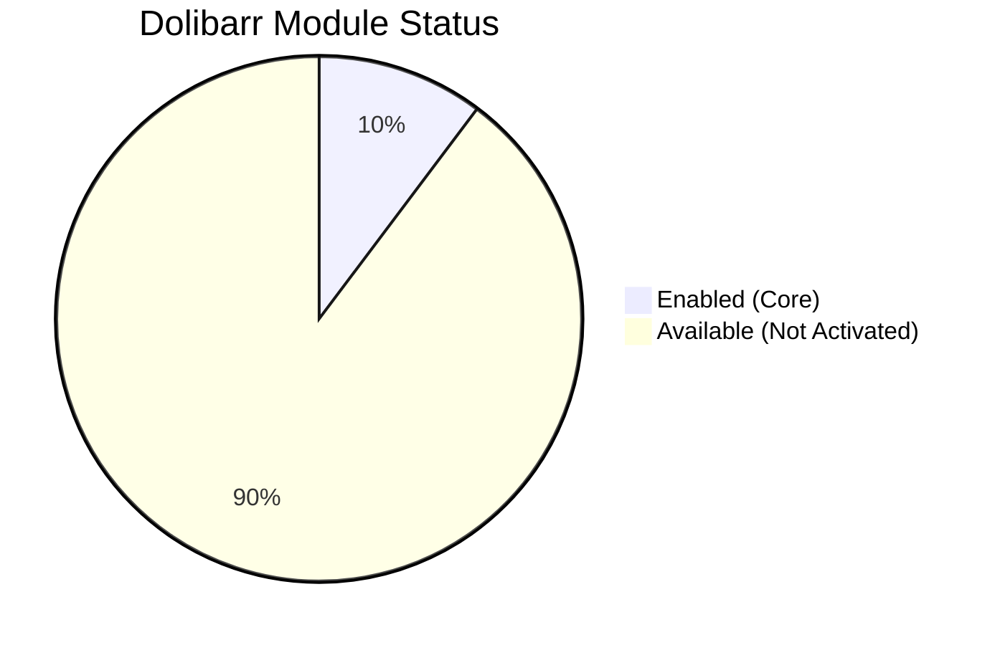
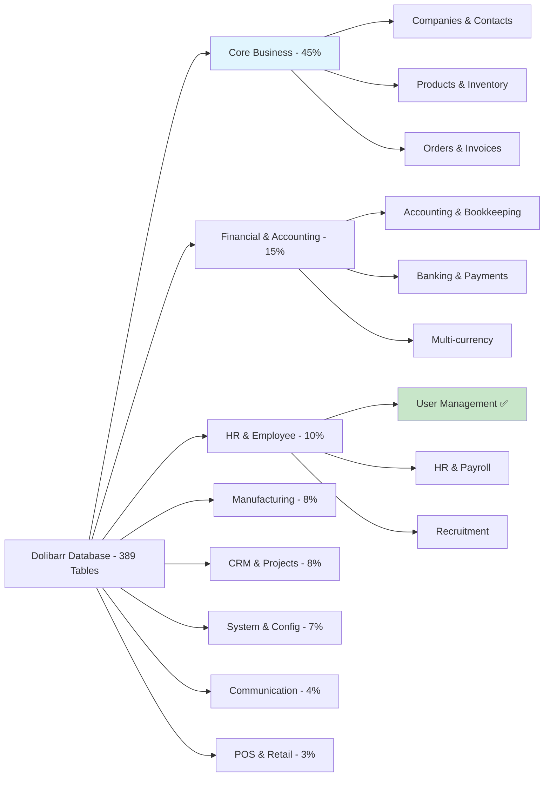

# Dolibarr Modules Status

This document provides a comprehensive overview of the Dolibarr modules available in this installation, including their enablement status and associated database tables.

## Currently Enabled Core Modules

Based on the database configuration (`llx_const` table), the following core modules are **currently enabled**:

### ✅ **ADHERENT** - Member Management
- **Status**: `ENABLED`
- **Purpose**: Manage members, subscriptions, and membership types
- **Tables**: 
  - `llx_adherent` - Member records
  - `llx_adherent_extrafields` - Custom member fields
  - `llx_adherent_type` - Membership types
  - `llx_adherent_type_extrafields` - Custom membership type fields
  - `llx_adherent_type_lang` - Multi-language support

### ✅ **FOURNISSEUR** - Supplier Management  
- **Status**: `ENABLED`
- **Purpose**: Manage suppliers, supplier orders, and supplier invoices
- **Tables**:
  - `llx_commande_fournisseur*` - Supplier orders
  - `llx_facture_fourn*` - Supplier invoices
  - `llx_supplier_proposal*` - Supplier proposals

### ✅ **SOCIETE** - Third Party Management
- **Status**: `ENABLED` 
- **Purpose**: Core module for managing companies, customers, and suppliers
- **Tables**:
  - `llx_societe*` - Company records
  - `llx_socpeople` - Contacts within companies

### ✅ **USER** - User Management
- **Status**: `ENABLED`
- **Purpose**: System user accounts and permissions
- **Tables**:
  - `llx_user*` - User accounts and profiles
  - `llx_usergroup*` - User groups and permissions

## Available Modules by Category

Based on the database table structure analysis, the following modules are **available** (tables present) in this Dolibarr installation:

## 📊 **Financial & Accounting Modules**

### 💰 Accounting
- **Tables**: `llx_accounting_*` (8 tables)
- **Features**: Chart of accounts, bookkeeping, fiscal years, journals
- **Status**: Tables present (available for activation)

### 🏦 Banking & Payments
- **Tables**: `llx_bank*`, `llx_payment*`, `llx_paiement*` (15+ tables)  
- **Features**: Bank accounts, payment tracking, reconciliation
- **Status**: Tables present (available for activation)

### 📄 Invoicing & Billing
- **Tables**: `llx_facture*`, `llx_facturedet*` (10+ tables)
- **Features**: Customer invoices, recurring invoices, invoice lines
- **Status**: Tables present (available for activation)

## 🛒 **Sales & Commerce Modules**

### 💼 Commercial Proposals
- **Tables**: `llx_propal*`, `llx_propaldet*` (5+ tables)
- **Features**: Quotations, proposal management, conversion to orders
- **Status**: Tables present (available for activation)

### 📋 Orders & Commands
- **Tables**: `llx_commande*`, `llx_commandedet*` (6+ tables)
- **Features**: Customer orders, order lines, order tracking
- **Status**: Tables present (available for activation)

### 📦 Expeditions & Deliveries
- **Tables**: `llx_expedition*`, `llx_delivery*` (8+ tables)
- **Features**: Shipping management, delivery tracking, packaging
- **Status**: Tables present (available for activation)

## 📦 **Inventory & Product Modules**

### 🏭 Product Management
- **Tables**: `llx_product*` (25+ tables)
- **Features**: Product catalog, variants, pricing, stock management
- **Status**: Tables present (available for activation)

### 📊 Stock & Warehouse
- **Tables**: `llx_stock_*`, `llx_entrepot*`, `llx_inventory*` (10+ tables)
- **Features**: Inventory tracking, warehouse management, stock movements
- **Status**: Tables present (available for activation)

### 🔄 Stock Transfers
- **Tables**: `llx_stocktransfer_*` (4+ tables)
- **Features**: Inter-warehouse transfers, transfer tracking
- **Status**: Tables present (available for activation)

## 👥 **CRM & Project Modules**

### 📞 Activities & Communications
- **Tables**: `llx_actioncomm*` (4+ tables)
- **Features**: CRM activities, reminders, communication tracking
- **Status**: Tables present (available for activation)

### 🎯 Project Management
- **Tables**: `llx_projet*`, `llx_projet_task*` (4+ tables)
- **Features**: Projects, tasks, time tracking, project billing
- **Status**: Tables present (available for activation)

### 🎟️ Ticket System
- **Tables**: `llx_ticket*` (2+ tables)
- **Features**: Support tickets, issue tracking, customer service
- **Status**: Tables present (available for activation)

## 👨‍💼 **HR & Employee Modules**

### 🏖️ Holiday Management
- **Tables**: `llx_holiday*` (5+ tables)
- **Features**: Leave requests, holiday tracking, approval workflows
- **Status**: Tables present (available for activation)

### 💼 Human Resources
- **Tables**: `llx_hrm_*` (8+ tables)
- **Features**: Job positions, skills, evaluations, HR management
- **Status**: Tables present (available for activation)

### 💰 Salary & Expenses
- **Tables**: `llx_salary*`, `llx_expensereport*` (8+ tables)
- **Features**: Payroll, expense reports, reimbursements
- **Status**: Tables present (available for activation)

### 👔 Recruitment
- **Tables**: `llx_recruitment_*` (4+ tables)
- **Features**: Job positions, candidate management, recruitment process
- **Status**: Tables present (available for activation)

## 🏭 **Manufacturing & Operations**

### 🔧 Manufacturing (MRP)
- **Tables**: `llx_mrp_*`, `llx_bom_*` (8+ tables)
- **Features**: Manufacturing orders, bill of materials, production planning
- **Status**: Tables present (available for activation)

### 🏭 Workstations
- **Tables**: `llx_workstation_*` (3+ tables)
- **Features**: Production workstations, resource management
- **Status**: Tables present (available for activation)

### 💎 Assets Management
- **Tables**: `llx_asset*` (8+ tables)
- **Features**: Fixed assets, depreciation, asset tracking
- **Status**: Tables present (available for activation)

## 📧 **Communication & Marketing**

### 📮 Email Marketing
- **Tables**: `llx_mailing*`, `llx_emailcollector*` (7+ tables)
- **Features**: Email campaigns, mass mailing, email collection
- **Status**: Tables present (available for activation)

### 🌐 Website Management
- **Tables**: `llx_website*` (3+ tables)
- **Features**: Website builder, page management, web content
- **Status**: Tables present (available for activation)

## 🤝 **Partnerships & Contracts**

### 🤝 Partnerships
- **Tables**: `llx_partnership*` (2+ tables)
- **Features**: Partner management, partnership tracking
- **Status**: Tables present (available for activation)

### 📋 Contracts & Services
- **Tables**: `llx_contrat*`, `llx_fichinter*` (8+ tables)
- **Features**: Service contracts, interventions, recurring services
- **Status**: Tables present (available for activation)

## 💳 **Point of Sale & Retail**

### 🛒 Point of Sale (POS)
- **Tables**: `llx_pos_*`, `llx_takepos_*` (3+ tables)
- **Features**: POS interface, cash management, restaurant orders
- **Status**: Tables present (available for activation)

## 📈 **Advanced Features**

### 💱 Multi-currency
- **Tables**: `llx_multicurrency*` (2+ tables)
- **Features**: Multiple currency support, exchange rates
- **Status**: Tables present (available for activation)

### 🏷️ Categories & Classification
- **Tables**: `llx_categorie*`, `llx_element_categorie` (15+ tables)
- **Features**: Hierarchical categorization for all entities
- **Status**: Tables present (available for activation)

### 📊 Knowledge Management
- **Tables**: `llx_knowledgemanagement_*` (2+ tables)
- **Features**: Knowledge base, documentation management
- **Status**: Tables present (available for activation)

### 🎫 Event Organization
- **Tables**: `llx_eventorganization_*` (2+ tables)
- **Features**: Conference/booth management, attendee tracking
- **Status**: Tables present (available for activation)

## 🔧 **System & Infrastructure**

### ⚙️ System Configuration
- **Tables**: `llx_const`, `llx_menu`, `llx_boxes*` (5+ tables)
- **Features**: System configuration, menu management, dashboard widgets
- **Status**: Core system tables (always active)

### 📁 Document Management (ECM)
- **Tables**: `llx_ecm_*` (4+ tables)
- **Features**: Document storage, file management, directories
- **Status**: Tables present (available for activation)

### 🔐 OAuth & Security
- **Tables**: `llx_oauth_*` (2+ tables)
- **Features**: OAuth integration, external authentication
- **Status**: Tables present (available for activation)

### ⏰ Scheduled Jobs
- **Tables**: `llx_cronjob` (1 table)
- **Features**: Automated task scheduling, background jobs
- **Status**: Tables present (available for activation)

## Summary Statistics

- **✅ Enabled Modules**: 4 core modules
- **📦 Available Modules**: 35+ module categories
- **🗄️ Total Database Tables**: 389 tables
- **🏗️ Architecture**: Fully modular with extensible design

## Module Activation Status

## Database Coverage by Module Category

## Next Steps

To activate additional modules:

1. **Access Dolibarr Admin Interface**:
   - URL: http://localhost:18080
   - Login: admin
   - Navigate to: Setup → Modules/Applications

2. **Database Impact**: 
   - Enabling modules will populate corresponding tables with configuration data
   - Some modules may create additional tables dynamically

3. **Recommended Activation Order**:
   1. **Products & Services** (if needed for inventory)
   2. **Invoicing** (for billing functionality)  
   3. **Projects** (for project management)
   4. **CRM Activities** (for sales tracking)

---

*This analysis was performed by examining the database structure of a live Dolibarr instance. Module availability is determined by table presence, while activation status is confirmed through configuration settings.*
