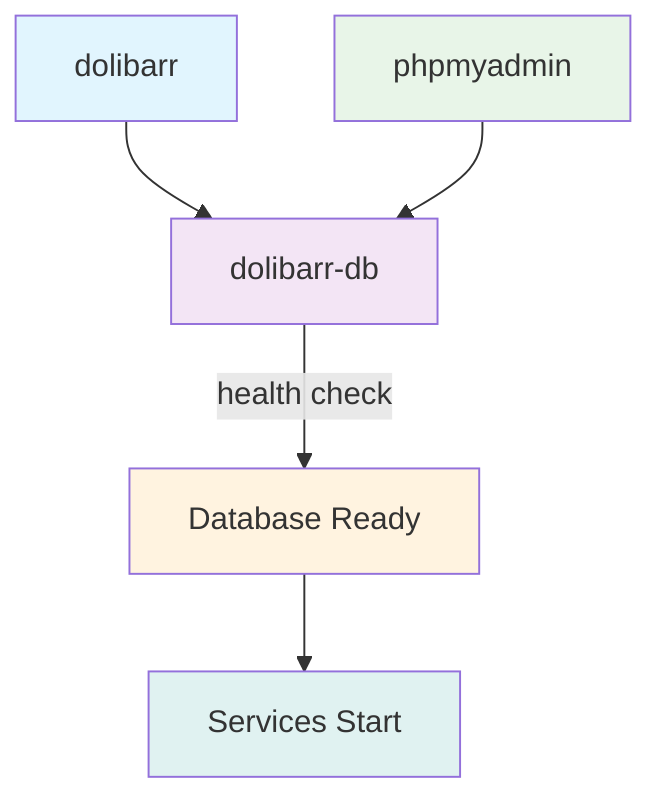

# Docker Services Reference

This document provides a comprehensive reference of all Docker services, containers, volumes, and networks used in the Dolibarr Docker setup.

## Table of Contents

- [Service Overview](#service-overview)
- [Service Profiles](#service-profiles)
- [Service Specifications](#service-specifications)
- [Volumes and Storage](#volumes-and-storage)
- [Networks](#networks)
- [Port Mappings](#port-mappings)
- [Health Checks](#health-checks)
- [Dependencies](#dependencies)
- [Configuration Examples](#configuration-examples)

---

## Service Overview

The Dolibarr Docker setup consists of three main services that can be deployed in different combinations based on your needs:

| Service | Image | Purpose | Required |
|---------|--------|---------|----------|
| `dolibarr` | `dolibarr/dolibarr:latest` | Main application server | ✅ Always |
| `dolibarr-db` | `mariadb:10.11` | Internal database | ⚠️ Profile-based |
| `phpmyadmin` | `phpmyadmin/phpmyadmin:latest` | Database management | ❌ Optional |

---

## Service Profiles

Docker Compose profiles control which services are started based on your deployment scenario:

### Profile: `internal-db`
**Services**: `dolibarr` + `dolibarr-db`
**Use case**: Production with internal database, development without tools
```bash
docker-compose --profile internal-db up -d
# OR
task services:start
```

### Profile: `internal-db-tools`
**Services**: `dolibarr` + `dolibarr-db` + `phpmyadmin`
**Use case**: Development with database management tools
```bash
docker-compose --profile internal-db --profile internal-db-tools up -d
# OR
task services:start-with-tools
```

### Profile: `external-db`
**Services**: `dolibarr` only
**Use case**: Production with external/managed database
```bash
docker-compose --profile external-db up -d
# OR
task services:start-external
```

---

## Service Specifications

### dolibarr Service

**Container Name**: `dolibarr-app`
**Image**: `dolibarr/dolibarr:latest`
**Restart Policy**: `unless-stopped`

#### Port Configuration
```yaml
ports:
  - "${DOLIBARR_PORT:-8080}:80"
```
- **Host Port**: Configurable via `DOLIBARR_PORT` environment variable
- **Container Port**: 80 (HTTP)
- **Default Host Port**: 8080

#### Environment Variables
```yaml
environment:
  # Database configuration
  DOLI_DB_TYPE: ${DB_TYPE:-mysqli}
  DOLI_DB_HOST: ${DB_HOST:-dolibarr-db}
  DOLI_DB_PORT: ${DB_PORT:-3306}
  DOLI_DB_NAME: ${DB_NAME:-dolibarr}
  DOLI_DB_USER: ${DB_USER:-dolibarr}
  DOLI_DB_PASSWORD: ${DB_PASSWORD}
  DOLI_DB_ROOT_PASSWORD: ${DB_ROOT_PASSWORD:-}
  
  # Application configuration
  DOLI_ADMIN_LOGIN: ${DOLIBARR_ADMIN_LOGIN:-admin}
  DOLI_ADMIN_PASSWORD: ${DOLIBARR_ADMIN_PASSWORD}
  DOLI_URL_ROOT: ${DOLIBARR_URL_ROOT:-http://localhost:8080}
  DOLI_NOCSRFCHECK: ${DOLIBARR_NOCSRFCHECK:-0}
  DOLI_HTTPS: ${DOLIBARR_HTTPS:-0}
  
  # PHP configuration
  PHP_INI_DATE_TIMEZONE: ${TIMEZONE:-Europe/Paris}
```

#### Volume Mounts
```yaml
volumes:
  - dolibarr-html:/var/www/html          # Application files
  - dolibarr-documents:/var/www/documents # Documents and uploads
  - ./custom:/var/www/html/custom         # Custom modules (bind mount)
  - ./logs:/var/www/html/documents/admin/temp # Application logs (bind mount)
```

#### Dependencies
```yaml
depends_on:
  dolibarr-db:
    condition: service_healthy  # Waits for database health check
    required: false             # Optional dependency for external DB
```

#### Networks
- `dolibarr-network`

---

### dolibarr-db Service

**Container Name**: `dolibarr-db`
**Image**: `mariadb:10.11`
**Restart Policy**: `unless-stopped`
**Profile**: `internal-db`

#### Port Configuration
```yaml
ports:
  - "${DB_EXTERNAL_PORT:-3306}:3306"
```
- **Host Port**: Configurable via `DB_EXTERNAL_PORT`
- **Container Port**: 3306 (MySQL)
- **Default Host Port**: 3306

#### Environment Variables
```yaml
environment:
  MYSQL_ROOT_PASSWORD: ${DB_ROOT_PASSWORD}      # Root password
  MYSQL_DATABASE: ${DB_NAME:-dolibarr}          # Database name
  MYSQL_USER: ${DB_USER:-dolibarr}              # Application user
  MYSQL_PASSWORD: ${DB_PASSWORD}                # Application password
  MYSQL_CHARSET: utf8mb4                        # Character set
  MYSQL_COLLATION: utf8mb4_unicode_ci           # Collation
```

#### Volume Mounts
```yaml
volumes:
  - dolibarr-db-data:/var/lib/mysql        # Database files
  - ./db-init:/docker-entrypoint-initdb.d  # Initialization scripts
```

#### Health Check
```yaml
healthcheck:
  test: ["CMD", "healthcheck.sh", "--connect", "--innodb_initialized"]
  start_period: 10s    # Grace period before first check
  interval: 10s        # Check interval
  timeout: 5s          # Timeout per check
  retries: 3           # Maximum retries
```

#### Networks
- `dolibarr-network`

---

### phpmyadmin Service

**Container Name**: `dolibarr-phpmyadmin`
**Image**: `phpmyadmin/phpmyadmin:latest`
**Restart Policy**: `unless-stopped`
**Profile**: `internal-db-tools`

#### Port Configuration
```yaml
ports:
  - "${PHPMYADMIN_PORT:-8081}:80"
```
- **Host Port**: Configurable via `PHPMYADMIN_PORT`
- **Container Port**: 80 (HTTP)
- **Default Host Port**: 8081

#### Environment Variables
```yaml
environment:
  PMA_HOST: dolibarr-db                # Target database host
  PMA_PORT: 3306                       # Target database port
  PMA_USER: ${DB_USER:-dolibarr}       # Default login user
  PMA_PASSWORD: ${DB_PASSWORD}         # Default login password
  MYSQL_ROOT_PASSWORD: ${DB_ROOT_PASSWORD} # Root password for admin
```

#### Dependencies
```yaml
depends_on:
  dolibarr-db:
    condition: service_healthy  # Waits for database to be ready
```

#### Networks
- `dolibarr-network`

---

## Volumes and Storage

### Named Volumes

#### `dolibarr-html`
- **Purpose**: Stores Dolibarr application files
- **Mount Point**: `/var/www/html`
- **Driver**: `local`
- **Persistence**: Survives container recreation
- **Contents**: PHP files, configuration, web assets

#### `dolibarr-documents`
- **Purpose**: Stores user documents and uploads
- **Mount Point**: `/var/www/documents`
- **Driver**: `local`
- **Persistence**: Survives container recreation
- **Contents**: User uploads, generated PDFs, attachments

#### `dolibarr-db-data`
- **Purpose**: Stores database files
- **Mount Point**: `/var/lib/mysql`
- **Driver**: `local`
- **Persistence**: Survives container recreation
- **Contents**: MySQL/MariaDB data files

### Bind Mounts

#### `./custom`
- **Purpose**: Custom modules and extensions
- **Mount Point**: `/var/www/html/custom`
- **Type**: Bind mount (host directory)
- **Persistence**: Always persistent on host
- **Contents**: Custom Dolibarr modules, themes

#### `./logs`
- **Purpose**: Application logs
- **Mount Point**: `/var/www/html/documents/admin/temp`
- **Type**: Bind mount (host directory)
- **Persistence**: Always persistent on host
- **Contents**: Error logs, access logs, debug information

#### `./db-init`
- **Purpose**: Database initialization scripts
- **Mount Point**: `/docker-entrypoint-initdb.d`
- **Type**: Bind mount (host directory)
- **Contents**: SQL scripts, shell scripts for database initialization

---

## Networks

### dolibarr-network
- **Driver**: `bridge`
- **Purpose**: Internal communication between services
- **Connectivity**: All services can communicate using service names as hostnames
- **Isolation**: Services are isolated from other Docker networks

#### Network Communication
```
dolibarr-app:80 ←→ dolibarr-db:3306
dolibarr-app:80 ←→ dolibarr-phpmyadmin:80
dolibarr-phpmyadmin:80 ←→ dolibarr-db:3306
```

---

## Port Mappings

### Default Port Configuration

| Service | Internal Port | Default Host Port | Environment Variable |
|---------|---------------|-------------------|---------------------|
| Dolibarr | 80 | 8080 | `DOLIBARR_PORT` |
| Database | 3306 | 3306 | `DB_EXTERNAL_PORT` |
| phpMyAdmin | 80 | 8081 | `PHPMYADMIN_PORT` |

### Port Conflict Resolution

When default ports conflict with existing services:

#### Development Environment
```env
# Use high ports to avoid conflicts
DOLIBARR_PORT=18080
PHPMYADMIN_PORT=18081
DB_EXTERNAL_PORT=13306
```

#### Production Environment
```env
# Use standard ports with reverse proxy
DOLIBARR_PORT=8080
# Don't expose database port
# DB_EXTERNAL_PORT=3306  # Comment out
# Don't expose phpMyAdmin
# PHPMYADMIN_PORT=8081   # Comment out
```

---

## Health Checks

### Database Health Check

The MariaDB service includes a comprehensive health check:

```yaml
healthcheck:
  test: ["CMD", "healthcheck.sh", "--connect", "--innodb_initialized"]
  start_period: 10s
  interval: 10s
  timeout: 5s
  retries: 3
```

#### Health Check States
- **starting**: Initial grace period (10 seconds)
- **healthy**: Database is ready to accept connections
- **unhealthy**: Failed health checks (after 3 retries)

#### Manual Health Check
```bash
# Check health status
docker-compose ps

# View health check logs
docker inspect dolibarr-db --format='{{json .State.Health}}'
```

### Application Health Monitoring

While the Dolibarr container doesn't have built-in health checks, you can monitor it:

```bash
# Check if web server is responding
curl -f http://localhost:${DOLIBARR_PORT:-8080}/index.php

# Check container logs
docker-compose logs dolibarr

# Check process status inside container
docker-compose exec dolibarr ps aux
```

---

## Dependencies

### Service Dependency Graph



### Startup Sequence

1. **Network Creation**: `dolibarr-network` is created
2. **Volume Creation**: Named volumes are created if they don't exist
3. **Database Start**: `dolibarr-db` container starts (if using internal database)
4. **Health Check Wait**: System waits for database health check to pass
5. **Application Start**: `dolibarr` container starts after database is healthy
6. **Tools Start**: `phpmyadmin` starts after database is healthy (if enabled)

### Dependency Handling

#### Soft Dependencies
The Dolibarr service uses soft dependencies:
```yaml
depends_on:
  dolibarr-db:
    condition: service_healthy
    required: false  # Allows external database usage
```

This allows the same configuration to work with both internal and external databases.

---

## Configuration Examples

### Development Configuration

Complete docker-compose override for development:

```yaml
# docker-compose.override.yml
version: '3.8'

services:
  dolibarr:
    environment:
      # Development-specific settings
      DOLI_NOCSRFCHECK: 1  # Disable CSRF for testing
    volumes:
      # Additional development volumes
      - ./debug:/var/www/html/debug
    labels:
      # Labels for development tools
      - "traefik.enable=true"
      - "traefik.http.routers.dolibarr-dev.rule=Host(`dolibarr.localhost`)"

  dolibarr-db:
    environment:
      # Development database settings
      MYSQL_GENERAL_LOG: 1
      MYSQL_GENERAL_LOG_FILE: /var/lib/mysql/general.log
    ports:
      # Expose additional ports for debugging
      - "13306:3306"

  # Additional development services
  mailhog:
    image: mailhog/mailhog:latest
    ports:
      - "18025:8025"  # Web interface
      - "11025:1025"  # SMTP
    networks:
      - dolibarr-network
```

### Production Configuration

Production-optimized configuration:

```yaml
# docker-compose.prod.yml
version: '3.8'

services:
  dolibarr:
    restart: always
    environment:
      # Production security settings
      DOLI_NOCSRFCHECK: 0
      DOLI_HTTPS: 1
    volumes:
      # Production-specific volumes
      - /mnt/shared/dolibarr/documents:/var/www/documents
      - /mnt/shared/dolibarr/html:/var/www/html
    logging:
      driver: "json-file"
      options:
        max-size: "10m"
        max-file: "3"
    deploy:
      resources:
        limits:
          memory: 1G
          cpus: '1'
        reservations:
          memory: 512M
          cpus: '0.5'

  # Remove database service for external database
  dolibarr-db:
    profiles:
      - disabled  # Effectively disables the service

  # Remove phpMyAdmin for production
  phpmyadmin:
    profiles:
      - disabled  # Effectively disables the service
```

### High Availability Configuration

Multi-instance setup for high availability:

```yaml
# docker-compose.ha.yml
version: '3.8'

services:
  dolibarr-1:
    extends:
      file: docker-compose.yml
      service: dolibarr
    container_name: dolibarr-app-1
    environment:
      - INSTANCE_ID=1
    volumes:
      # Shared storage
      - nfs-documents:/var/www/documents
      - nfs-html:/var/www/html

  dolibarr-2:
    extends:
      file: docker-compose.yml
      service: dolibarr
    container_name: dolibarr-app-2
    environment:
      - INSTANCE_ID=2
    volumes:
      # Shared storage
      - nfs-documents:/var/www/documents
      - nfs-html:/var/www/html
    ports:
      - "8081:80"  # Different port for second instance

  # Load balancer
  haproxy:
    image: haproxy:latest
    ports:
      - "80:80"
      - "443:443"
    volumes:
      - ./haproxy.cfg:/usr/local/etc/haproxy/haproxy.cfg:ro
      - ./ssl:/etc/ssl/certs:ro
    depends_on:
      - dolibarr-1
      - dolibarr-2
    networks:
      - dolibarr-network

volumes:
  nfs-documents:
    driver: local
    driver_opts:
      type: nfs
      o: addr=nfs.example.com,rw
      device: ":/mnt/dolibarr/documents"

  nfs-html:
    driver: local
    driver_opts:
      type: nfs
      o: addr=nfs.example.com,rw
      device: ":/mnt/dolibarr/html"
```

---

## Service Management Commands

### Starting Services

```bash
# Start with internal database
docker-compose --profile internal-db up -d
task services:start

# Start with development tools
docker-compose --profile internal-db --profile internal-db-tools up -d
task services:start-with-tools

# Start with external database
docker-compose --profile external-db up -d
task services:start-external
```

### Stopping Services

```bash
# Stop all services
docker-compose down
task services:stop

# Stop and remove volumes (DANGEROUS)
docker-compose down -v
task maintenance:reset-data
```

### Service Status

```bash
# Check service status
docker-compose ps
task services:status

# Check service logs
docker-compose logs -f
task services:logs

# Check specific service logs
docker-compose logs -f dolibarr
task services:logs-app
```

### Service Scaling

```bash
# Scale Dolibarr service (for load balancing)
docker-compose --profile external-db up -d --scale dolibarr=3

# Note: Requires external database and shared storage
```

---

## Troubleshooting Services

### Common Service Issues

#### Database Connection Issues
```bash
# Check database health
docker-compose exec dolibarr-db mysqladmin ping -h localhost

# Test database connection from app
docker-compose exec dolibarr nc -zv dolibarr-db 3306

# Check database logs
docker-compose logs dolibarr-db
```

#### Application Startup Issues
```bash
# Check application logs
docker-compose logs dolibarr

# Check if web server is running
docker-compose exec dolibarr ps aux | grep apache

# Check file permissions
docker-compose exec dolibarr ls -la /var/www/html
```

#### Network Issues
```bash
# Check network connectivity
docker network ls | grep dolibarr
docker network inspect dolibarr_dolibarr-network

# Test service-to-service communication
docker-compose exec dolibarr ping dolibarr-db
```

### Performance Monitoring

```bash
# Monitor resource usage
docker stats

# Monitor specific service
docker stats dolibarr-app

# Check volume usage
docker system df -v
```

---

## Best Practices

### Security Best Practices

1. **Port Exposure**: Only expose necessary ports to the host
2. **Secrets Management**: Use Docker secrets for sensitive data in production
3. **Network Isolation**: Use custom networks to isolate services
4. **Resource Limits**: Set memory and CPU limits for production
5. **Regular Updates**: Keep container images updated

### Performance Best Practices

1. **Volume Strategy**: Use named volumes for data that needs persistence
2. **Resource Allocation**: Allocate appropriate CPU and memory resources
3. **Health Checks**: Implement proper health checks for reliability
4. **Logging**: Configure appropriate logging drivers and retention
5. **Monitoring**: Implement monitoring for production deployments

### Maintenance Best Practices

1. **Backup Strategy**: Regular backups of volumes and configurations
2. **Update Process**: Planned update process with rollback capabilities
3. **Monitoring**: Continuous monitoring of service health and performance
4. **Documentation**: Keep service documentation up to date
5. **Testing**: Test configuration changes in development first
