# Troubleshooting Guide

This guide provides solutions to common issues encountered when deploying and managing Dolibarr with Docker. Issues are organized by category with step-by-step troubleshooting procedures.

## Quick Diagnostics

### Health Check Commands

Start troubleshooting with these quick diagnostic commands:

```bash
# Overall system health
task utilities:health

# Container status
task services:status

# View recent logs
task services:logs-app | tail -50
task services:logs-db | tail -50

# Check disk space
df -h

# Check memory usage
free -h

# Check Docker resources
docker system df
```

### Common Diagnostic Flow

```mermaid
flowchart TD
    START[🚨 Issue Detected] --> CHECK{System Health Check}
    CHECK -->|Pass| LOGS[📋 Check Application Logs]
    CHECK -->|Fail| CONTAINER[🐳 Check Container Status]
    
    CONTAINER --> RESTART{Try Container Restart}
    RESTART -->|Success| MONITOR[✅ Monitor System]
    RESTART -->|Fail| REBUILD[🔨 Rebuild Containers]
    
    LOGS --> ERROR{Error Messages Found?}
    ERROR -->|Yes| SPECIFIC[🎯 Specific Issue Resolution]
    ERROR -->|No| PERFORMANCE[⚡ Performance Analysis]
    
    SPECIFIC --> RESOLVE[🔧 Apply Fix]
    RESOLVE --> TEST[✅ Test Solution]
    
    style START fill:#ffebee
    style CHECK fill:#fff3e0
    style RESOLVE fill:#e8f5e8
    style TEST fill:#e1f5fe
```



## Container Issues

### Container Won't Start

**Symptoms**:
- `docker-compose up` fails
- Containers exit immediately
- "Container not running" errors

**Diagnostic Steps**:
```bash
# Check container status
docker-compose ps

# View container logs
docker-compose logs dolibarr
docker-compose logs dolibarr-db

# Check for port conflicts
netstat -tulpn | grep -E ':(8080|3306|8081)'

# Verify environment file
cat .env | grep -v '^#' | grep -v '^$'
```

**Common Solutions**:

1. **Port Conflicts**:
   ```bash
   # Change ports in .env file
   DOLIBARR_PORT=8090
   PHPMYADMIN_PORT=8091
   DB_EXTERNAL_PORT=3307
   
   # Restart services
   task services:stop
   task services:start-with-tools
   ```

2. **Environment File Issues**:
   ```bash
   # Verify .env file exists and is properly formatted
   ls -la .env
   
   # Copy from example if missing
   cp .env.example .env
   
   # Edit with proper values
   nano .env
   ```

3. **Resource Constraints**:
   ```bash
   # Check available resources
   docker system df
   docker system prune -f
   
   # Free up disk space
   docker volume prune -f
   docker image prune -f
   ```

### Container Keeps Restarting

**Symptoms**:
- Containers start but immediately restart
- High CPU usage from Docker daemon
- "Restarting" status in `docker ps`

**Diagnostic Steps**:
```bash
# Check restart policy
docker inspect dolibarr_dolibarr_1 | grep -A 3 RestartPolicy

# Monitor container behavior
docker logs -f dolibarr_dolibarr_1

# Check container health
docker inspect dolibarr_dolibarr_1 | grep -A 5 Health
```

**Solutions**:

1. **Memory Issues**:
   ```bash
   # Increase memory limits in docker-compose.yml
   services:
     dolibarr:
       deploy:
         resources:
           limits:
             memory: 1G
   ```

2. **Configuration Errors**:
   ```bash
   # Check environment variables
   docker-compose config
   
   # Validate configuration syntax
   docker-compose -f docker-compose.yml config
   ```

3. **Database Connection Issues**:
   ```bash
   # Test database connectivity
   docker-compose exec dolibarr-db mysql -u dolibarr -p$DB_PASSWORD -e "SELECT 1"
   ```

## Database Issues

### Database Connection Failed

**Symptoms**:
- "Connection refused" errors
- "Access denied for user" messages
- Dolibarr showing database error pages

**Diagnostic Steps**:
```bash
# Check database container status
docker-compose ps dolibarr-db

# Test database connection
docker-compose exec dolibarr-db mysql -u root -p$DB_ROOT_PASSWORD -e "SHOW DATABASES;"

# Check database logs
docker-compose logs dolibarr-db | tail -50

# Verify environment variables
echo $DB_PASSWORD
echo $DB_ROOT_PASSWORD
```

**Solutions**:

1. **Wrong Credentials**:
   ```bash
   # Update .env file with correct credentials
   DB_PASSWORD=your_correct_password
   DB_ROOT_PASSWORD=your_correct_root_password
   
   # Recreate containers
   docker-compose down
   docker-compose up -d
   ```

2. **Database Not Ready**:
   ```bash
   # Wait for database initialization
   docker-compose logs -f dolibarr-db | grep "ready for connections"
   
   # Manual retry after database is ready
   docker-compose restart dolibarr
   ```

3. **Corrupted Database**:
   ```bash
   # Stop services
   task services:stop
   
   # Remove database volume (WARNING: DATA LOSS)
   docker volume rm dolibarr_dolibarr-db-data
   
   # Restart services (fresh database)
   task services:start-with-tools
   ```

### Database Performance Issues

**Symptoms**:
- Slow query responses
- High CPU usage from database container
- Connection timeouts

**Diagnostic Steps**:
```bash
# Check database resource usage
docker stats dolibarr_dolibarr-db_1

# Check database configuration
docker-compose exec dolibarr-db mysql -u root -p$DB_ROOT_PASSWORD -e "SHOW VARIABLES LIKE 'innodb%'"

# Monitor slow queries
docker-compose exec dolibarr-db mysql -u root -p$DB_ROOT_PASSWORD -e "SHOW FULL PROCESSLIST"
```

**Solutions**:

1. **Optimize Database Configuration**:
   ```ini
   # Create db-init/mysql-tuning.cnf
   [mysqld]
   innodb_buffer_pool_size = 512M
   innodb_log_file_size = 128M
   query_cache_size = 64M
   max_connections = 50
   ```

2. **Add Database Indexes**:
   ```sql
   -- Connect to database and add indexes for common queries
   USE dolibarr;
   SHOW INDEX FROM llx_facture;
   ```

## Application Issues

### Web Interface Not Accessible

**Symptoms**:
- "Connection refused" on port 8080
- "502 Bad Gateway" errors
- Blank pages or timeouts

**Diagnostic Steps**:
```bash
# Test application connectivity
curl -I http://localhost:8080

# Check application logs
task services:logs-app | grep -i error

# Verify port mapping
docker-compose ps | grep 8080

# Test from inside container
docker-compose exec dolibarr curl -I http://localhost
```

**Solutions**:

1. **Port Binding Issues**:
   ```bash
   # Check if port is available
   netstat -tulpn | grep :8080
   
   # Use different port
   DOLIBARR_PORT=8090
   docker-compose up -d
   ```

2. **Container Health Issues**:
   ```bash
   # Check container health
   docker-compose exec dolibarr ps aux
   
   # Restart web service inside container
   docker-compose exec dolibarr service apache2 restart
   ```

3. **File Permission Problems**:
   ```bash
   # Fix file permissions
   task utilities:permissions
   
   # Or manually
   docker-compose exec dolibarr chown -R www-data:www-data /var/www/html
   ```

### Dolibarr Installation Wizard Issues

**Symptoms**:
- Installation wizard loops
- "Database already exists" errors
- Configuration file write errors

**Solutions**:

1. **Reset Installation**:
   ```bash
   # Remove configuration file
   docker-compose exec dolibarr rm -f /var/www/html/conf/conf.php
   
   # Clear cache
   docker-compose exec dolibarr rm -rf /var/www/html/documents/install.lock
   ```

2. **Database Reset**:
   ```bash
   # Complete reset (WARNING: DATA LOSS)
   task maintenance:reset-data
   
   # Restart with fresh installation
   task services:start-with-tools
   ```

## Performance Issues

### High Resource Usage

**Symptoms**:
- High CPU or memory usage
- Slow response times
- System becoming unresponsive

**Diagnostic Steps**:
```bash
# Monitor resource usage
docker stats

# Check system resources
htop
iotop

# Analyze container resource usage
docker-compose exec dolibarr top
docker-compose exec dolibarr-db top
```

**Solutions**:

1. **Set Resource Limits**:
   ```yaml
   # Add to docker-compose.yml
   services:
     dolibarr:
       deploy:
         resources:
           limits:
             memory: 512M
             cpus: '0.5'
   ```

2. **Optimize Application**:
   ```bash
   # Clear application cache
   docker-compose exec dolibarr find /var/www/html/documents -name "*.cache" -delete
   
   # Restart services
   task services:stop
   task services:start
   ```

### Slow Database Queries

**Symptoms**:
- Long page load times
- Database timeouts
- High database CPU usage

**Solutions**:

1. **Database Optimization**:
   ```sql
   -- Analyze table usage
   USE dolibarr;
   ANALYZE TABLE llx_societe, llx_facture, llx_product;
   
   -- Optimize tables
   OPTIMIZE TABLE llx_societe, llx_facture, llx_product;
   ```

2. **Query Cache Configuration**:
   ```ini
   # Add to db-init/query-cache.cnf
   [mysqld]
   query_cache_type = 1
   query_cache_size = 64M
   query_cache_limit = 2M
   ```

## Network Issues

### Connection Timeouts

**Symptoms**:
- "Connection timed out" errors
- Intermittent connectivity
- Services unreachable from outside

**Diagnostic Steps**:
```bash
# Test network connectivity
docker network ls
docker network inspect dolibarr_default

# Check DNS resolution
docker-compose exec dolibarr nslookup dolibarr-db
docker-compose exec dolibarr ping -c 3 dolibarr-db

# Verify port accessibility
telnet localhost 8080
telnet localhost 3306
```

**Solutions**:

1. **Firewall Issues**:
   ```bash
   # Check firewall rules
   sudo ufw status
   
   # Allow necessary ports
   sudo ufw allow 8080/tcp
   sudo ufw allow 3306/tcp
   ```

2. **Docker Network Issues**:
   ```bash
   # Recreate Docker network
   docker-compose down
   docker network prune -f
   docker-compose up -d
   ```

## Storage and Backup Issues

### Disk Space Issues

**Symptoms**:
- "No space left on device" errors
- Backup failures
- Database write errors

**Diagnostic Steps**:
```bash
# Check disk usage
df -h
du -sh /var/lib/docker/

# Check Docker space usage
docker system df

# Check volume usage
docker volume ls
docker volume inspect dolibarr_dolibarr-db-data
```

**Solutions**:

1. **Clean Up Docker Resources**:
   ```bash
   # Safe cleanup
   task maintenance:cleanup
   
   # More aggressive cleanup
   docker system prune -a -f --volumes
   ```

2. **Move Data Location**:
   ```bash
   # Stop services
   task services:stop
   
   # Copy data to new location
   sudo rsync -av /var/lib/docker/volumes/ /new/location/volumes/
   
   # Update Docker daemon configuration
   # Edit /etc/docker/daemon.json
   {
     "data-root": "/new/location/docker"
   }
   ```

### Backup/Restore Failures

**Symptoms**:
- Backup tasks fail
- Restore operations incomplete
- Corrupted backup files

**Diagnostic Steps**:
```bash
# Test backup functionality
task backup:backup-db

# Check backup directory permissions
ls -la ./backups/

# Verify backup file integrity
gunzip -t ./backups/*/database_*.sql.gz
```

**Solutions**:

1. **Permission Issues**:
   ```bash
   # Fix backup directory permissions
   chmod 755 ./backups/
   chown -R $(whoami):$(whoami) ./backups/
   ```

2. **Database Access Issues**:
   ```bash
   # Test database access
   docker-compose exec dolibarr-db mysql -u root -p$DB_ROOT_PASSWORD -e "SHOW DATABASES;"
   
   # Restart database if needed
   docker-compose restart dolibarr-db
   ```

## Task Automation Issues

### Task Command Failures

**Symptoms**:
- `task: command not found`
- Task execution failures
- Permission denied errors

**Solutions**:

1. **Install Task**:
   ```bash
   # macOS
   brew install go-task/tap/go-task
   
   # Linux
   curl -sL https://taskfile.dev/install.sh | sh
   ```

2. **Fix Task Permissions**:
   ```bash
   # Check Taskfile permissions
   ls -la Taskfile.yml .taskfile/
   
   # Fix if needed
   chmod 644 Taskfile.yml .taskfile/*.yml
   ```

3. **Docker Permission Issues**:
   ```bash
   # Add user to docker group (Linux)
   sudo usermod -aG docker $USER
   
   # Re-login for changes to take effect
   ```

## Security Issues

### Password and Authentication Problems

**Symptoms**:
- Login failures
- "Access denied" errors
- Password reset issues

**Solutions**:

1. **Reset Admin Password**:
   ```bash
   # Access database directly
   docker-compose exec dolibarr-db mysql -u root -p$DB_ROOT_PASSWORD dolibarr
   
   # Reset admin password (in MySQL)
   UPDATE llx_user SET pass_crypted = MD5('newpassword') WHERE login = 'admin';
   ```

2. **Check User Permissions**:
   ```sql
   -- In MySQL/MariaDB
   USE dolibarr;
   SELECT login, admin, statut FROM llx_user WHERE login = 'admin';
   ```

## Log Analysis

### Important Log Locations

```bash
# Application logs
docker-compose logs dolibarr

# Database logs
docker-compose logs dolibarr-db

# System logs
journalctl -u docker.service

# Dolibarr application logs (inside container)
docker-compose exec dolibarr tail -f /var/www/html/documents/dolibarr.log
```

### Log Analysis Commands

```bash
# Search for errors
docker-compose logs | grep -i error

# Search for specific patterns
docker-compose logs | grep -i "database\|connection\|failed"

# Export logs for analysis
docker-compose logs > dolibarr_logs_$(date +%Y%m%d_%H%M%S).txt
```

## Emergency Procedures

### Complete System Recovery

If all else fails, follow these steps for complete system recovery:

```bash
# 1. Backup current data (if possible)
task backup:backup || echo "Backup failed, proceeding anyway"

# 2. Stop all services
docker-compose down -v

# 3. Clean up Docker system
docker system prune -a -f --volumes

# 4. Restore from backup
# (Copy backup files to appropriate locations)

# 5. Restart from clean state
task setup:init
task services:start-with-tools

# 6. Restore data if backup was successful
# task backup:restore-db BACKUP_FILE=path/to/backup.sql.gz
# task backup:restore-app BACKUP_FILE=path/to/backup.tar.gz
```

### Contact Points for Additional Help

- **Dolibarr Community**: [https://www.dolibarr.org/forum](https://www.dolibarr.org/forum)
- **Docker Documentation**: [https://docs.docker.com/](https://docs.docker.com/)
- **GitHub Issues**: Create an issue in the project repository
- **Docker Community**: [https://forums.docker.com/](https://forums.docker.com/)

## Prevention Tips

### Regular Maintenance

```bash
# Weekly maintenance routine
task utilities:health           # Check system health
task backup:backup             # Create backup
task maintenance:cleanup       # Clean up resources

# Monthly maintenance
task maintenance:update        # Update containers
docker system prune -f        # Clean up unused resources
```

### Monitoring Setup

Set up regular monitoring to prevent issues:

```bash
# Add to crontab for regular health checks
*/15 * * * * cd /path/to/dolibarr && task utilities:health > /dev/null || echo "Health check failed" | mail -s "Dolibarr Alert" admin@example.com
```

This comprehensive troubleshooting guide should help resolve most common issues encountered with the Dolibarr Docker deployment.
