# Dolibarr Docker Use Cases

This document outlines practical use cases for the Dolibarr Docker deployment, demonstrating how different organizations and scenarios can benefit from this setup.

## Overview

The Dolibarr Docker setup is designed to be flexible and scalable, supporting various business needs from small startups to larger organizations. With 13 enabled modules and comprehensive task automation, it provides a complete ERP/CRM solution.

## Business Use Cases

### 🏢 Small Business Management

**Scenario**: A small consulting company with 5-15 employees needs integrated customer management, project tracking, and invoicing.

**Enabled Modules Used**:
- **SOCIETE** - Customer and supplier management
- **PROJET** - Project tracking and time management
- **FACTURE** - Invoice generation and billing
- **ACTIONCOMM** - Calendar and meeting management
- **PRODUCT** - Service catalog management

**Workflow**:

```mermaid
flowchart LR
    PROSPECT[👤 New Prospect] --> CONTACT[📞 Initial Contact]
    CONTACT --> PROPOSAL[📄 Create Proposal]
    PROPOSAL --> PROJECT[📋 Start Project]
    PROJECT --> TIMETRACK[⏱️ Track Time]
    TIMETRACK --> INVOICE[💰 Generate Invoice]
    INVOICE --> PAYMENT[💳 Payment]
```


**Setup Commands**:
```bash
# Quick setup for small business
task config:setup-dev-environment

# Enable additional modules if needed
task config:enable-modules

# Check configuration
task config:show-config
```

### 🏭 Manufacturing & Inventory Management

**Scenario**: A small manufacturing company needs to track inventory, manage suppliers, and handle product orders.

**Enabled Modules Used**:
- **PRODUCT** - Product catalog and specifications
- **STOCK** - Inventory management
- **COMMANDE** - Order management
- **FOURNISSEUR** - Supplier relationship management
- **FACTURE** - Invoice processing

**Key Features**:
- Real-time stock levels
- Automated reorder points
- Supplier comparison
- Product cost tracking
- Order fulfillment workflow

### 💼 Professional Services Firm

**Scenario**: A law firm, accounting firm, or consultancy needing client management, project billing, and document tracking.

**Enabled Modules Used**:
- **SOCIETE** - Client management
- **PROJET** - Case/project management
- **ACTIONCOMM** - Client communication tracking
- **FACTURE** - Professional billing
- **CATEGORIE** - Client and service categorization

**Benefits**:
- Centralized client information
- Time-based billing
- Document management
- Compliance tracking
- Performance analytics

### 🎯 Sales & Marketing Organization

**Scenario**: A sales-focused company needing CRM functionality, proposal management, and sales pipeline tracking.

**Enabled Modules Used**:
- **SOCIETE** - Lead and customer management
- **PROPAL** - Proposal creation and tracking
- **COMMANDE** - Order processing
- **ACTIONCOMM** - Sales activity tracking
- **CATEGORIE** - Lead categorization

**Sales Pipeline**:


### 🏘️ Non-Profit Organization

**Scenario**: A non-profit organization managing members, donations, events, and volunteer projects.

**Enabled Modules Used**:
- **ADHERENT** - Member management
- **ACTIONCOMM** - Event planning and tracking
- **PROJET** - Volunteer project coordination
- **FACTURE** - Donation receipts
- **CATEGORIE** - Member and donor categorization

**Features**:
- Membership tracking
- Donation management
- Volunteer coordination
- Event planning
- Grant tracking

## Technical Use Cases

### 🔧 Development & Testing Environment

**Scenario**: Developers need a local Dolibarr instance for testing integrations, custom modules, or API development.

**Setup**:
```bash
# Start development environment
task services:start-with-tools

# Enable API for testing
task config:enable-api

# Load demo data for testing
task config:load-demo-data

# Access API documentation
# http://localhost:18080/api/index.php/explorer
```

**Features**:
- API testing environment
- Demo data for development
- phpMyAdmin for database inspection
- Custom module development support

### 🚀 Production Deployment

**Scenario**: Deploy Dolibarr for production use with external database and proper security.

**Setup Steps**:
```bash
# 1. Configure external database
cp .env.example .env
# Edit .env with production settings

# 2. Start with external database
task services:start-external

# 3. Configure for production
task config:configure-company
task config:enable-modules

# 4. Setup backup schedule
task backup:backup  # Add to cron
```

**Production Checklist**:
- ✅ External database configured
- ✅ Strong passwords set
- ✅ Regular backups scheduled
- ✅ SSL/TLS configured
- ✅ Monitoring enabled

### 📊 Data Migration & Integration

**Scenario**: Migrating from another system or integrating with existing business tools.

**Approach**:
1. **Data Export**: Export data from existing system
2. **Database Preparation**: Use database init scripts
3. **API Integration**: Use REST API for ongoing sync
4. **Testing**: Validate data integrity

**Tools Available**:
```bash
# Database access for migration
task utilities:shell-db

# API access for integration
# REST API available at /api/index.php

# Backup before migration
task backup:backup

# Custom module directory
# ./custom/ for integration modules
```

### 🔄 Multi-Environment Setup

**Scenario**: Separate development, staging, and production environments.

**Environment Structure**:
```
dolibarr-dev/     # Development environment
├── .env          # Dev-specific settings
└── custom/       # Development modules

dolibarr-staging/ # Staging environment
├── .env          # Staging settings
└── backups/      # Staging backups

dolibarr-prod/    # Production environment
├── .env          # Production settings
├── backups/      # Production backups
└── custom/       # Production modules
```

**Management**:
```bash
# Development
cd dolibarr-dev && task services:start-with-tools

# Staging
cd dolibarr-staging && task services:start

# Production
cd dolibarr-prod && task services:start-external
```

## Integration Use Cases

### 🔗 API-First Integration

**Scenario**: Using Dolibarr as a backend service with custom frontend applications.

**Enabled Features**:
- **API Module**: REST API access
- **Authentication**: API key management
- **Data Access**: Complete CRUD operations

**Example Integration**:
```javascript
// JavaScript example
const api = new DolibarrAPI('http://localhost:18080/api/index.php');
api.setApiKey('your-api-key');

// Get customers
const customers = await api.get('/thirdparties');

// Create invoice
const invoice = await api.post('/invoices', {
  socid: customerId,
  date: '2024-01-01'
});
```

### 📱 Mobile App Backend

**Scenario**: Mobile app for field sales or service teams.

**API Endpoints Used**:
- `/thirdparties` - Customer data
- `/proposals` - Create quotes on-site
- `/orders` - Order management
- `/invoices` - Invoice generation
- `/agendaevents` - Calendar sync

### 🔄 E-commerce Integration

**Scenario**: Connect online store with Dolibarr for order management.

**Integration Flow**:

```mermaid
flowchart LR
    ECOM[🛒 E-commerce Site] --> ORDER[📦 New Order]
    ORDER --> API[🔗 Dolibarr API]
    API --> CUSTOMER[👤 Create/Update Customer]
    API --> INVOICE[💰 Generate Invoice]
    API --> STOCK[📊 Update Inventory]
    STOCK --> FULFILLMENT[📫 Fulfillment]
```


## Scaling Scenarios

### 📈 Growth Planning

**Small → Medium Business Transition**:

**Phase 1**: Basic Setup (1-10 users)
- Internal database
- Core modules
- Single server

**Phase 2**: Expansion (10-50 users)
- External database
- Additional modules
- Performance optimization

**Phase 3**: Enterprise (50+ users)
- High availability setup
- Multiple environments
- Advanced monitoring

### 🌐 Multi-Location Deployment

**Scenario**: Multiple offices or locations needing centralized management.

**Architecture Options**:
1. **Centralized**: Single instance, multi-entity
2. **Distributed**: Multiple instances with data sync
3. **Hybrid**: Regional instances with central reporting

## Best Practices by Use Case

### 🔒 Security Considerations

**For Production Use**:
```bash
# Change default passwords
# Edit .env file with strong passwords

# Remove development tools
# Don't use --profile internal-db-tools in production

# Regular updates
task maintenance:update

# Regular backups
task backup:backup
```

### ⚡ Performance Optimization

**For High-Volume Use**:
- Use external database with optimized configuration
- Regular maintenance tasks
- Monitor resource usage
- Implement caching strategies

### 📊 Monitoring & Maintenance

**Regular Tasks**:
```bash
# Health checks
task utilities:health

# Log monitoring
task services:logs-app

# Database optimization
task utilities:shell-db
# Run OPTIMIZE TABLE commands

# Backup verification
task backup:list-backups
```

## Getting Started by Use Case

### Quick Setup Matrix

| Use Case | Profile | Additional Modules | API Needed | Custom Code |
|----------|---------|-------------------|------------|-------------|
| Small Business | `internal-db-tools` | ✅ All enabled | ❌ | ❌ |
| Manufacturing | `internal-db` | ✅ Stock, Suppliers | ❌ | Maybe |
| Development | `internal-db-tools` | ✅ All enabled | ✅ | ✅ |
| Production | `external-db` | ✅ Business-specific | ✅ | Maybe |
| Integration | `internal-db` | ✅ API required | ✅ | ✅ |

### Setup Commands by Use Case

```bash
# Small Business
task config:setup-dev-environment
task services:start-with-tools

# Production
task services:start-external
task config:configure-company
task config:enable-modules

# Development
task services:start-with-tools
task config:enable-api
task config:load-demo-data

# Integration Testing
task services:start
task config:enable-api
# Custom setup as needed
```

## Conclusion

The Dolibarr Docker setup provides flexibility for various business scenarios, from simple small business management to complex enterprise integrations. The modular architecture and comprehensive task automation make it suitable for rapid deployment and easy maintenance across different use cases.

Choose the appropriate setup based on your specific needs, and leverage the extensive module system to customize functionality for your business requirements.
